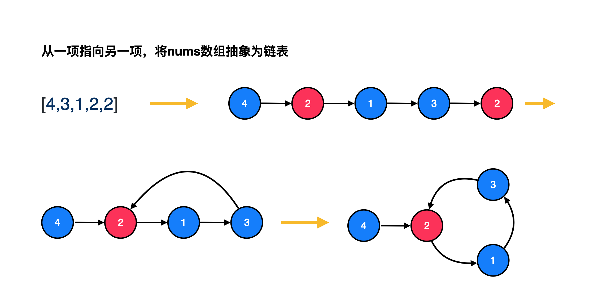
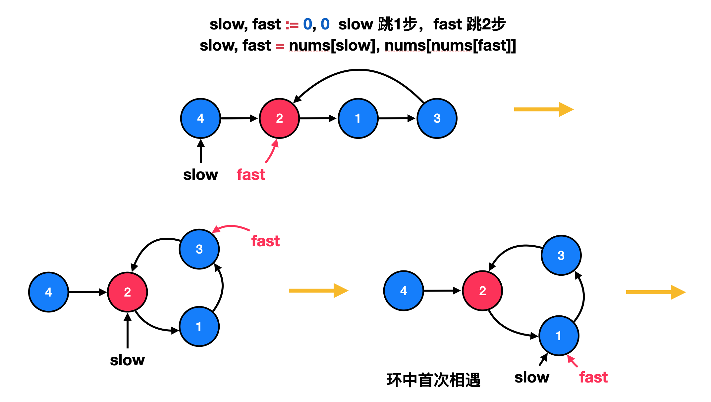
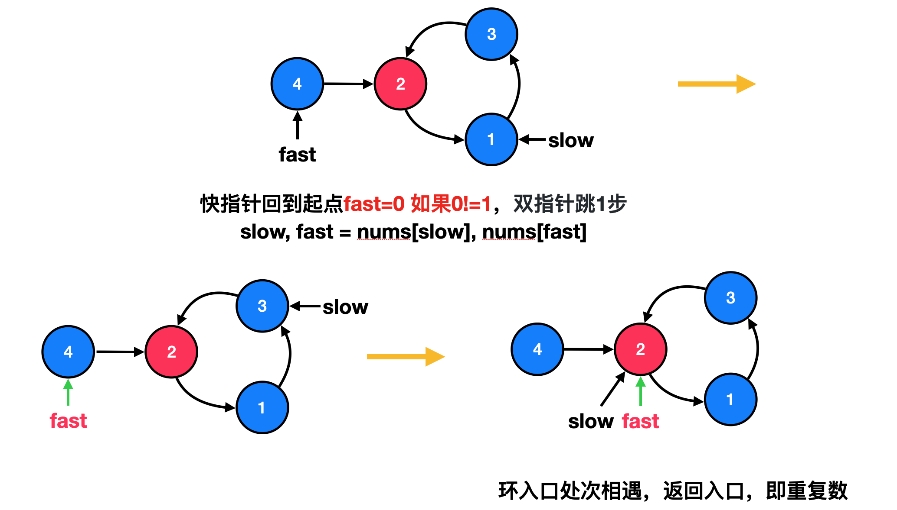

## [287. 寻找重复数](https://leetcode-cn.com/problems/find-the-duplicate-number/)


```go
func findDuplicate(nums []int) int {
	slow, fast := 0, 0
	for slow, fast = nums[slow], nums[nums[fast]]; slow != fast; { // 首次相遇
		slow, fast = nums[slow], nums[nums[fast]]
	}
	fast = 0
	for fast != slow {
		slow, fast = nums[slow], nums[fast]
	}
	return slow // 环入口再次相遇
}
```


```go
func findDuplicate(nums []int) int {
	slow, fast := 0, 0
	for {
		slow, fast = nums[slow], nums[nums[fast]] // slow 跳1步，fast 跳2步
		if slow == fast {                         // 指针在环中首次相遇
			fast = 0 // 让快指针回到起点
			for {
				if slow == fast { // 指针在入口处再次相遇
					return slow // 返回入口，即重复数
				}
				slow, fast = nums[slow], nums[fast] // 两个指针每次都跳1步
			}
		}
	}
}
```


**方法一：快慢指针**

**预备知识：「Floyd 判圈算法」（又称龟兔赛跑算法）**

我们使用两个指针，fast与 slow。它们起始都位于链表的头部。随后，slow 指针每次向后移动一个位置，
而 fast 指针向后移动两个位置。如果链表中存在环，则 fast 指针最终将再次与 slow 指针在环中相遇。

如下图所示，设链表中环外部分的长度为 a。slow 指针进入环后，又走了 
b 的距离与 fast 相遇。此时，fast 指针已经走完了环的 n 圈，因此它走过的总距离为 a+n(b+c)+b=a+(n+1)b+nc。


根据题意，**任意时刻，fast 指针走过的距离都为 slow 指针的 2 倍**。因此，我们有 a+(n+1)b+nc=2(a+b)⟹a=c+(n−1)(b+c) 有了 a=c+(n−1)(b+c) 的等量关系，
我们会发现：从相遇点到入环点的距离加上 n−1 圈的环长，恰好等于从链表头部到入环点的距离。

因此，当发现 slow 与 fast 相遇时，我们再额外使用一个指针 ptr。起始，它指向链表头部；随后，它和 slow 每次向后移动一个位置。最终，它们会在入环点相遇。


题目条件

- 数组只读——不能去移动数组，不能排序
- 常量空间——不能使用哈希表，不能新建数组再排序
- 时间复杂度小于 O(N^2)——不能用暴力法
- 只有一个数字重复，但可能重复多次

**公式推导解释**

我们使用两个指针，fast与 slow。它们起始都位于链表的头部。随后，slow 指针每次向后移动一个位置，
而 fast 指针向后移动两个位置。如果链表中存在环，则 fast 指针最终将再次与 slow 指针在环中相遇。因为slow 还没走完1圈就会被fast追上。每走 1 轮，fast 与 slow 的间距 +1，fast 终会追上 slow；

如下图所示，设链表中环外部分的长度为 a。slow 指针进入环后，又走了 
b 的距离与 fast 相遇。此时，fast 指针已经走完了环的 n 圈，因此它走过的总距离为 a+n(b+c)+b=a+(n+1)b+nc。


- 相遇时，慢指针走的距离：**a+b**
- 假设相遇时快指针已经绕环 n 次，它走的距离：**a+n(b+c)+b = a+(n+1)b+nc**
- 为快指针的速度是 2 倍，所以相同时间走的距离也是 2 倍：
    a+(n+1)b+nc=2(a+b)  ⟹ a = c + (n-1)(b+c) 

我们不关心绕了几次环，取 n = 1 这种特定情况，消掉圈数：**a=c**

**怎么利用 a=c 求入环点**
-  在循环的过程中，快慢指针相遇，位置相同了，可以确定出相遇点
-  为了确定「入环点」，我们「人为制造」快慢指针在入环点相遇
-  让快指针从头节点出发，速度改为和慢指针一样，慢指针留在首次相遇点，同时出发
-  因为 a=c ，二者速度相同，所以会同时到达入环点

**思路与算法**

分析这个数组，索引从 0～n ，值域是 1～n 。值域，在索引的范围内，值可以当索引使。
比如，nums 数组： [4,3,1,2,2]

- 以 nums[0] 的值 4 作为索引，去到 nums[4]
- 以 nums[4] 的值 2 作为索引，去到 nums[2]
- 以 nums[2] 的值 1 作为索引，去到 nums[1]
- 以 nums[1] 的值 3 作为索引，去到 nums[3]
- 以 nums[3] 的值 2 作为索引，去到 nums[2]

从一项指向另一项，将nums数组抽象为链表：
**4->2->1->3->2** ，如下图，链表有环。







有环链表，重复数就是入环口

题目说数组必存在重复数，所以 nums 数组肯定可以抽象为有环链表。
题目转为：求该有环链表的入环口。因为入环口的元素就是重复的链表节点值。


[环形链表 II](https://leetcode-cn.com/problems/linked-list-cycle-ii/solution/huan-xing-lian-biao-ii-by-leetcode-solution/)


[参考题解](https://leetcode-cn.com/problems/find-the-duplicate-number/solution/zhe-ge-shu-zu-you-dian-te-shu-suo-yi-ke-yi-yong-ku/)


## [剑指 Offer 03. 数组中重复的数字](https://leetcode-cn.com/problems/shu-zu-zhong-zhong-fu-de-shu-zi-lcof/)

**方法一：哈希表 / Set**

算法流程：

- 初始化： 新建 Map ，记为 m ；
- 遍历数组 nums 中的每个数字num ：
    1. 当 num 在 map 中，说明重复，直接返回 num ；
    2. 将 num 添加至 m 中；
- 返回 −1 。
- 
- 本题中一定有重复数字，因此这里返回多少都可以。
- 
**复杂度分析：**

- 时间复杂度 O(N) ： 遍历数组使用O(N) ，HashSet 添加与查找元素皆为 O(1) 。
- 空间复杂度 O(N) ： HashSet 占用 O(N) 大小的额外空间。


```go
func findRepeatNumber(nums []int) int {
    m := make(map[int]bool)
    for _,num := range nums {
        if _,ok := m[num];ok {
            return num
        }
        m[num] = true
    }
    return -1
}
```

**方法一：原地交换**

题目说明尚未被充分使用，即 在一个长度为 n 的数组 nums 里的所有数字都在 0 ~ n-1 的范围内 。 此说明含义：数组元素的 索引 和 值 是 一对多 的关系。
因此，可遍历数组并通过交换操作，使元素的 索引 与 值 一一对应（即 nums[i]=i ）。因而，就能通过索引映射对应的值，起到与字典等价的作用。


遍历中，第一次遇到数字 x 时，将其交换至索引 x 处；而当第二次遇到数字 x 时，一定有 nums[x]=x ，此时即可得到一组重复数字。

算法流程：

遍历数组 nums ，设索引初始值为 i=0 :
- 若 nums[i]=i ： 说明此数字已在对应索引位置，无需交换，因此跳过；
- 若 nums[nums[i]]=nums[i] ： 代表索引 nums[i] 处和索引 i 处的元素值都为 nums[i] ，即找到一组重复值，返回此值 nums[i] ；
- 否则： 交换索引为 i 和 nums[i] 的元素值，将此数字交换至对应索引位置。
若遍历完毕尚未返回，则返回 −1 。


```go
func findRepeatNumber(nums []int) int {
	for i := 0; i < len(nums); {
		if nums[i] == i { // nums[i]已在对应索引位置，无需交换，因此跳过；
			i++
			continue // 跳过
		}
		if nums[nums[i]] == nums[i] { // 索引 nums[i] 处和索引 i 处的元素值都为 nums[i] ，即找到一组重复值
			return nums[i]
		}
		nums[i], nums[nums[i]] = nums[nums[i]], nums[i] // 交换索引为 i 和 nums[i] 的元素值，将此数字交换至对应索引位置。
	}
	return -1
}
```

**复杂度分析：**

- 时间复杂度 O(N) ： 遍历数组使用 O(N) ，每轮遍历的判断和交换操作使用 O(1) 。
- 空间复杂度 O(1) ： 使用常数复杂度的额外空间。


