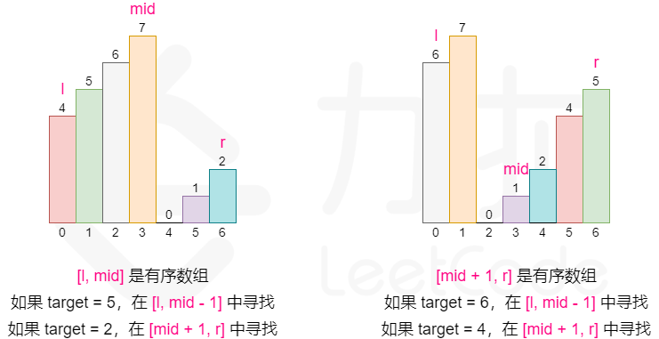
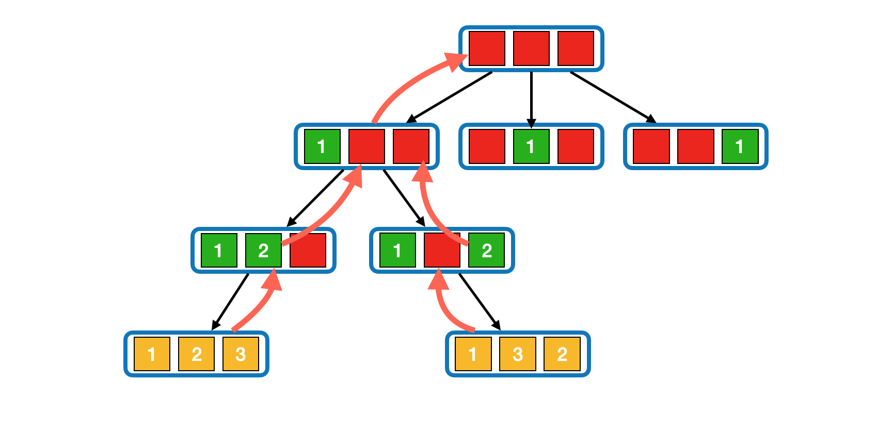
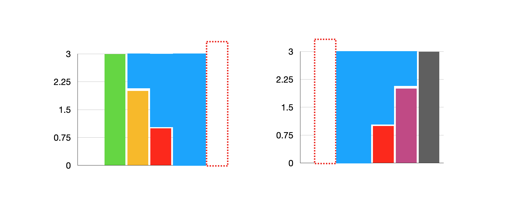

1. [✅ 33. 搜索旋转排序数组](#-33-搜索旋转排序数组)
2. [✅ 200. 岛屿数量](#-200-岛屿数量)
3. [✅ 46. 全排列](#-46-全排列)
4. [✅ 47. 全排列 II 补充](#-47-全排列-ii-补充)
5. [✅ 92. 反转链表 II](#-92-反转链表-ii)
6. [✅ 142. 环形链表 II](#-142-环形链表-ii)
7. [✅ 23. 合并K个升序链表](#-23-合并k个升序链表)
8. [✅ 54. 螺旋矩阵](#-54-螺旋矩阵)
9. [✅ 704. 二分查找](#-704-二分查找)
10. [✅ 300. 最长递增子序列](#-300-最长递增子序列)
11. [✅ 42. 接雨水](#-42-接雨水)


<!-- 
[33. 搜索旋转排序数组](https://leetcode-cn.com/problems/search-in-rotated-sorted-array/)

[200. 岛屿数量](https://leetcode-cn.com/problems/number-of-islands/)

[46. 全排列](https://leetcode-cn.com/problems/permutations/)

[47. 全排列 II](https://leetcode-cn.com/problems/permutations-ii/)  补充

[92. 反转链表 II](https://leetcode-cn.com/problems/reverse-linked-list-ii/)

[142. 环形链表 II](https://leetcode-cn.com/problems/linked-list-cycle-ii/)

[23. 合并K个升序链表](https://leetcode-cn.com/problems/merge-k-sorted-lists/)

[54. 螺旋矩阵](https://leetcode-cn.com/problems/spiral-matrix/)

[704. 二分查找](https://leetcode-cn.com/problems/binary-search/) 

[300. 最长递增子序列](https://leetcode-cn.com/problems/longest-increasing-subsequence/)

[42. 接雨水](https://leetcode-cn.com/problems/trapping-rain-water/) 
-->


## ✅ [33. 搜索旋转排序数组](https://leetcode-cn.com/problems/search-in-rotated-sorted-array/)



```go
func search(nums []int, target int) int {
	if len(nums) == 0 {
		return -1
	}
	l, r := 0, len(nums)-1
	for l <= r {
		mid := l + (r-l)>>1 //防止加法导致整数溢出 (l+r)>>1
		if target == nums[mid] {
			return mid
		}
		if nums[l] <= nums[mid] { //左边有序
			if nums[l] <= target && target < nums[mid] { //在左边
				r = mid - 1 //舍弃右边
			} else {
				l = mid + 1
			}
		} else { //右边有序
			if nums[mid] < target && target <= nums[r] {
				l = mid + 1
			} else {
				r = mid - 1
			}
		}
	}
	return -1
}
```

[参考](https://leetcode-cn.com/problems/search-in-rotated-sorted-array/solution/sou-suo-xuan-zhuan-pai-xu-shu-zu-by-leetcode-solut/)


## ✅ [200. 岛屿数量](https://leetcode-cn.com/problems/number-of-islands/)

**思路一：深度优先遍历DFS**

- 目标是找到矩阵中 “岛屿的数量” ，上下左右相连的 1 都被认为是连续岛屿。
- dfs方法： 设目前指针指向一个岛屿中的某一点 (i, j)，寻找包括此点的岛屿边界。
	1. 从 (i, j) 向此点的上下左右 (i,j+1),(i,j-1),(i-1,j),(i+1,j) 做深度搜索。
	2. 终止条件：
		- (i, j) 越过矩阵边界;
		- grid[i][j] == 0，代表此分支已越过岛屿边界。
	3. 搜索岛屿的同时，执行 grid[i][j] = '0'，即将岛屿所有节点删除，以免之后重复搜索相同岛屿。

**主循环：**

遍历整个矩阵，当遇到 grid[i][j] == '1' 时，从此点开始做深度优先搜索 dfs，岛屿数 count + 1 且在深度优先搜索中删除此岛屿。

- 最终返回岛屿数 count 即可。


```go
func numIslands(grid [][]byte) int {
	count := 0
	for i := 0; i < len(grid); i++ { //行
		for j := 0; j < len(grid[0]); j++ { //列
			if grid[i][j] == '1' {
				count++         //岛屿数量加1
				dfs(grid, i, j) //使用dfs将此岛屿所有元素变为0
			}
		}
	}
	return count
}
func dfs(grid [][]byte, i, j int) {
	if 0 <= i && i < len(grid) && 0 <= j && j < len(grid[0]) && grid[i][j] == '1' {
		grid[i][j] = '0'  //已遍历
		dfs(grid, i+1, j) //右
		dfs(grid, i-1, j) //左
		dfs(grid, i, j+1) //上
		dfs(grid, i, j-1) //下
	}
}
```

**闭包**

```go
func numIslands(grid [][]byte) int {
	var dfs func(grid [][]byte, i, j int)
	dfs = func(grid [][]byte, i, j int) {
		if (i < 0 || j < 0) || i >= len(grid) || j >= len(grid[0]) || grid[i][j] == '0' {
			return
		}
		grid[i][j] = '0'
		dfs(grid, i+1, j)
		dfs(grid, i-1, j)
		dfs(grid, i, j-1)
		dfs(grid, i, j+1)
	}
	count := 0
	for i := 0; i < len(grid); i++ {
		for j := 0; j < len(grid[0]); j++ {
			if grid[i][j] == '1' {
				dfs(grid, i, j)
				count++
			}
		}
	}
	return count
}
```


## ✅ [46. 全排列](https://leetcode-cn.com/problems/permutations/)


**方法一：枚举每个位置，放每个数 (回溯)**


我们从前往后，一位一位枚举，每次选择一个没有被使用过的数。
选好之后，将该数的状态改成“已被使用”，同时将该数记录在相应位置上，然后递归。
递归返回时，不要忘记将该数的状态改成“未被使用”，并将该数从相应位置上删除。

**闭包**：

```go
func permute(nums []int) [][]int {
	used, path, res, n := make(map[int]bool, len(nums)), []int{}, [][]int{}, len(nums)
	var dfs func(int)
	dfs = func(pos int) { // 枚举位置
		if len(path) == n {
			res = append(res, append([]int{}, path...))
			return
		}
		for i := 0; i < n; i++ { // 枚举所有的选择
			if !used[i] { // 第i个位置未使用
				used[i] = true               // 第i个位置已使用
				path = append(path, nums[i]) // 做出选择，记录路径
				dfs(pos + 1)                 // 枚举下一个位置
				used[i] = false              // 撤销选择
				path = path[:len(path)-1]    // 取消记录
			}
		}
	}
	dfs(0)
	return res
}
```


**方法二：枚举位置、枚举数 (回溯)**

这个问题可以看作有 n 个排列成一行的空格，我们需要从左往右依此填入题目给定的 n 个数，每个数只能使用一次。那么很直接的可以想到一种穷举的算法，即从左往右每一个位置都依此尝试填入一个数，看能不能填完这 n 个空格，在程序中我们可以用「回溯法」来模拟这个过程。

假设我们已经填到第 pos 个位置


```go
func permute(nums []int) [][]int {
	res, n := [][]int{}, len(nums)
	var dfs func(int)
	dfs = func(pos int) { // 枚举位置
		if pos == n { // 所有数都填完了
			res = append(res, append([]int{}, nums...))
			return
		}
		for i := pos; i < n; i++ {
			nums[i], nums[pos] = nums[pos], nums[i] // 枚举所有的选择
			dfs(pos + 1)                            // 枚举下一个位置
			nums[i], nums[pos] = nums[pos], nums[i] // 撤销操作
		}
	}
	dfs(0)
	return res
}
```


复杂度分析

- 时间复杂度：O(n×n!)，其中 n 为序列的长度。
- 空间复杂度：O(n)，其中 n 为序列的长度。除答案数组以外，递归函数在递归过程中需要为每一层递归函数分配栈空间，所以这里需要额外的空间且该空间取决于递归的深度，这里可知递归调用深度为 O(n)。

[参考](https://leetcode-cn.com/problems/permutations/solution/quan-pai-lie-by-leetcode-solution-2/)


**为什么加入解集时，要将数组（在go中是切片）内容拷贝到一个新的数组里，再加入解集。**

这个 path 变量是一个地址引用，结束当前递归，将它加入 res，后续的递归分支还要继续进行搜索，还要继续传递这个 path，这个地址引用所指向的内存空间还要继续被操作，所以 res 中的 path 所引用的内容会被改变，这就不对，所以要拷贝一份内容，到一份新的数组里，然后放入 res，这样后续对 path 的操作，就不会影响已经放入 res 的内容。


## ✅ [47. 全排列 II](https://leetcode-cn.com/problems/permutations-ii/) 补充

**方法一：枚举每个位置，放每个数 (回溯)**



我们将这个问题看作有 n 个排列成一行的空格，我们需要从左往右依次填入题目给定的 n 个数，每个数只能使用一次。那么很直接的可以想到一种穷举的算法，即从左往右每一个位置都依此尝试填入一个数，看能不能填完这 n 个空格，在程序中我们可以用「回溯法」来模拟这个过程。


假设我们有 3 个重复数排完序后相邻，那么我们一定保证每次都是拿从左往右第一个未被填过的数字，即整个数组的状态其实是保证了 
[未填入，未填入，未填入] 到 [填入，未填入，未填入]，再到 [填入，填入，未填入]，最后到 [填入，填入，填入] 的过程的，因此可以达到去重的目标。


**dfs 闭包**


```go
func permuteUnique(nums []int) [][]int {
	sort.Ints(nums)
	used, path, res, n := make(map[int]bool, len(nums)), []int{}, [][]int{}, len(nums)
	var dfs func(int)
	dfs = func(pos int) { // 枚举位置
		if len(path) == n {
			res = append(res, append([]int{}, path...))
			return
		}
		for i := 0; i < n; i++ { // 枚举出所有的选择
			if used[i] || i > 0 && !used[i-1] && nums[i-1] == nums[i] { // 已使用 或 重复
				continue // 跳过
			}
			used[i] = true               // 记录路径上做过的选择
			path = append(path, nums[i]) // 做出选择，记录路径
			dfs(pos + 1)                 // 枚举下一个位置
			used[i] = false              // 撤销选择
			path = path[:len(path)-1]    // 取消记录
		}
	}
	dfs(0)
	return res
}
```


## ✅ [92. 反转链表 II](https://leetcode-cn.com/problems/reverse-linked-list-ii/)

- pre: 是 precursor (前驱) 的缩写
- succ : 是 successor (后继) 的缩写
- pre -> prev -> curr -> succ


**方法一：双指针** 

```go
/**
 * Definition for singly-linked list.
 * type ListNode struct {
 *     Val int
 *     Next *ListNode
 * }
 */
func reverseBetween(head *ListNode, left int, right int) *ListNode {
	dummy := &ListNode{Next: head}
	pre := dummy // pre -> prev -> curr 
	for i := 0; i < left-1; i++ {
		pre = pre.Next
	}
	prev, curr := pre.Next, pre.Next.Next
	for i := 0; i < right-left; i++ {
		next := curr.Next
		curr.Next = prev
		prev = curr
		curr = next
	}
	pre.Next.Next = curr // 2 -> 5
	pre.Next = prev      // 1 -> 4
	return dummy.Next
}
```


**方法二：头插法** 


```go
/**
 * Definition for singly-linked list.
 * type ListNode struct {
 *     Val int
 *     Next *ListNode
 * }
 */
func reverseBetween(head *ListNode, left int, right int) *ListNode {
	dummy := &ListNode{Next: head}
	pre := dummy // pre -> curr -> next		1 -> 2 -> 3
	for i := 0; i < left-1; i++ {
		pre = pre.Next
	}
	curr := pre.Next
	for i := 0; i < right-left; i++ {
		next := curr.Next
		curr.Next = next.Next // 2 -> 4
		next.Next = pre.Next  // 3 -> 2
		pre.Next = next       // 1 -> 3
	}
	return dummy.Next
}
```


[参考](https://leetcode-cn.com/problems/reverse-linked-list-ii/solution/fan-zhuan-lian-biao-ii-by-leetcode-solut-teyq/)


## ✅ [142. 环形链表 II](https://leetcode-cn.com/problems/linked-list-cycle-ii/)

**方法一：快慢指针**

我们使用两个指针，fast 与 slow。它们起始都位于链表的头部。随后，
- slow 指针每次向后移动一个位置，而 fast 指针向后移动两个位置。
- 如果链表中存在环，则 fast 指针最终将再次与 slow 指针在环中相遇。
- 当发现 slow 与 fast 相遇时，我们再额外使用一个指针 ptr。起始，它指向链表头部；随后，它和 slow 每次向后移动一个位置。最终，它们会在入环点相遇。


```go
/**
 * Definition for singly-linked list.
 * type ListNode struct {
 *     Val int
 *     Next *ListNode
 * }
 */
func detectCycle(head *ListNode) *ListNode {
	slow, fast := head, head
	for fast != nil {
		slow = slow.Next
		if fast.Next == nil {
			return nil
		}
		fast = fast.Next.Next
		if slow == fast { // 第一次相遇
			p := head
			for p != slow {
				p = p.Next
				slow = slow.Next
			}
			return p // 第二次相遇
		}
	}
	return nil
}
```


[参考](https://leetcode-cn.com/problems/linked-list-cycle-ii/solution/huan-xing-lian-biao-ii-by-leetcode-solution/)


## ✅ [23. 合并K个升序链表](https://leetcode-cn.com/problems/merge-k-sorted-lists/)

**方法二：分治合并**

```go
/**
 * Definition for singly-linked list.
 * type ListNode struct {
 *     Val int
 *     Next *ListNode
 * }
 */
func mergeKLists(lists []*ListNode) *ListNode {
	n := len(lists)
	if n < 1 {
		return nil
	}
	if n == 1 {
		return lists[0]
	}
	mid := n >> 1
	left, right := mergeKLists(lists[:mid]), mergeKLists(lists[mid:])
	return mergeTwoLists(left, right)
}
func mergeTwoLists(l1, l2 *ListNode) *ListNode {
	if l1 == nil {
		return l2
	}
	if l2 == nil {
		return l1
	}
	if l1.Val < l2.Val {
		l1.Next = mergeTwoLists(l1.Next, l2)
		return l1
	} else {
		l2.Next = mergeTwoLists(l1, l2.Next)
		return l2
	}
}
```

[参考](https://leetcode-cn.com/problems/merge-k-sorted-lists/solution/he-bing-kge-pai-xu-lian-biao-by-leetcode-solutio-2/)


## ✅ [54. 螺旋矩阵](https://leetcode-cn.com/problems/spiral-matrix/)


- 如果一条边从头遍历到底，则下一条边遍历的起点随之变化

- 选择不遍历到底，可以减小横向、竖向遍历之间的影响

- 轮迭代结束时，4条边的两端同时收窄 1

- 轮迭代所做的事情很清晰：遍历一个“圈”，遍历的范围收缩为内圈

- 层层向里处理，按顺时针依次遍历：上、右、下、左。

- 不再形成“环”了，就会剩下一行或一列，然后单独判断

**四个边界**

- 上边界 top : 0
- 下边界 bottom : matrix.length - 1
- 左边界 left : 0
- 右边界 right : matrix[0].length - 1

**矩阵不一定是方阵**
- top < bottom && left < right 是循环的条件
- 无法构成“环”了，就退出循环，退出时可能是这 3 种情况之一：
- top == bottom && left < right —— 剩一行
- top < bottom && left == right —— 剩一列
- top == bottom && left == right —— 剩一项（也是一行/列）

**处理剩下的单行或单列**
- 因为是按顺时针推入结果数组的，所以
- 剩下的一行，从左至右 依次推入结果数组
- 剩下的一列，从上至下 依次推入结果数组

**代码**

每个元素访问一次，

**复杂度**

- 时间复杂度 O(m*n)，m、n 分别是矩阵的行数和列数
- 空间复杂度 O(m*n)

```go
func spiralOrder(matrix [][]int) []int {
	if len(matrix) == 0 {
		return []int{}
	}
	res := []int{}
	top, right, bottom, left := 0, len(matrix[0])-1, len(matrix)-1, 0
	for top < bottom && left < right {	// 一条边不从头遍历到底 (不包括最后一个元素)
		for i := left; i < right; i ++ { res = append(res, matrix[top][i])}    // 上层  (top 行 i 列)
		for i := top; i < bottom; i ++ { res = append(res, matrix[i][right])}  // 右层  (i 行 right 列)
		for i := right; i > left; i -- { res = append(res, matrix[bottom][i])} // 下层  (bottom 行 i 列)
		for i := bottom; i > top; i -- { res = append(res, matrix[i][left])}   // 左层  (i 行 left 列)
		top ++		// 四个边界同时收缩，进入内层
		right -- 
		bottom --
		left ++
	}
	if top == bottom {
		for i := left; i <= right; i ++ { res = append(res, matrix[top][i])}  // 只剩一行，从左到右依次添加
	} else if left == right {
		for i := top; i <= bottom; i ++ { res = append(res, matrix[i][left])} // 只剩一列，从上到下依次添加
	}
	return res
}
```


**换一种遍历的策略：遍历到底**


- 循环的条件改为： top <= bottom && left <= right
- 每遍历一条边，下一条边遍历的起点被“挤占”，要更新相应的边界
- 值得注意的是，可能出现 在循环中途，不再满足循环的条件 ，即出现 top > bottom || left > right ，其中一对边界彼此交错了
- 这意味着此时所有项都遍历完了，如果没有及时 break ，就会重复遍历

**解决办法**

- 每遍历完一条边，更新完相应的边界后，都加一条判断 if (top > bottom || left > right) break，避免遍历完成时没有及时退出，导致重复遍历。
- 但你发现，**遍历完成要么发生在遍历完“上边”，要么发生在遍历完“右边”**
- 所以只需在这两步操作之后，加 if (top > bottom || left > right) break 即可

```go
func spiralOrder(matrix [][]int) []int {
	if len(matrix) == 0 {
		return []int{}
	}
	res := []int{}
	top, right, bottom, left := 0, len(matrix[0])-1, len(matrix)-1, 0
	for top <= bottom && left <= right {	// 一条边从头遍历到底 (包括最后一个元素)
		for i := left; i <= right; i ++ { res = append(res, matrix[top][i])}    // 上层  top 行 i 列
		top ++
		for i := top; i <= bottom; i ++ { res = append(res, matrix[i][right])}  // 右层  i 行 right 列
		right -- 
		if top > bottom || left > right { break }
		for i := right; i >= left; i -- { res = append(res, matrix[bottom][i])} // 下层  bottom 行 i 列
		bottom --
		for i := bottom; i >= top; i -- { res = append(res, matrix[i][left])}   // 左层  i 行 left 列
		left ++		// 四个边界同时收缩，进入内层	
	}
	return res
}
```


**换一种循环的条件，也是可以的**

- 遍历完所有项时，res 数组构建完毕。我们可以用 res 数组的长度 等于 矩阵的项的个数，作为循环的结束条件
- 不等于就继续遍历，等于就 break


```go
func spiralOrder(matrix [][]int) []int {
	if len(matrix) == 0 {
		return []int{}
	}
	res := []int{}
	top, right, bottom, left := 0, len(matrix[0])-1, len(matrix)-1, 0
	size := len(matrix) * len(matrix[0])
	for len(res) != size {			  // 仍未遍历结束
		for i := left; i <= right; i ++ { res = append(res, matrix[top][i])}    // 上层  top 行 i 列
		top ++
		for i := top; i <= bottom; i ++ { res = append(res, matrix[i][right])}  // 右层  i 行 right 列
		right -- 
		if len(res) == size { break } // 遍历结束
		for i := right; i >= left; i -- { res = append(res, matrix[bottom][i])} // 下层  bottom 行 i 列
		bottom --
		for i := bottom; i >= top; i -- { res = append(res, matrix[i][left])}   // 左层  i 行 left 列
		left ++		 				  // 四个边界同时收缩，进入内层	
	}
	return res
}
```


[参考](https://leetcode-cn.com/problems/spiral-matrix/solution/shou-hui-tu-jie-liang-chong-bian-li-de-ce-lue-kan-/)


## ✅ [704. 二分查找](https://leetcode-cn.com/problems/binary-search/)

1. 如果目标值等于中间元素，则找到目标值。
2. 如果目标值较小，继续在左侧搜索。
3. 如果目标值较大，则继续在右侧搜索。

**算法：**

- 初始化指针 left = 0, right = n - 1。
- 当 left <= right： // 等于：考察一个数
比较中间元素 nums[mid] 和目标值 target 。
	1. 如果 target = nums[mid]，返回 mid。
	2. 如果 target < nums[mid]，则在左侧继续搜索 right = mid - 1。
	3. 如果 target > nums[mid]，则在右侧继续搜索 left = mid + 1。


```go
func search(nums []int, target int) int {
	left, right := 0, len(nums)-1
	for left <= right {	
		mid := left + (right-left)>>1
		if nums[mid] == target {
			return mid
		} else if nums[mid] < target {
			left = mid + 1
		} else {
			right = mid - 1
		}
	}
	return -1
}
```
复杂度分析

- 时间复杂度：O(logN)。
- 空间复杂度：O(1)。


## ✅ [300. 最长递增子序列](https://leetcode-cn.com/problems/longest-increasing-subsequence/)

**方法一： nlogn 动态规划** 

```go
func lengthOfLIS(nums []int) int {
	dp := []int{} // 维护单调递增数组 sorted
	for _, x := range nums {
		// 在递增顺序的数组dp中搜索x，返回x的索引。如果查找不到，返回值是x应该插入dp的位置
		i := sort.SearchInts(dp, x) // min_index
		if i == len(dp) {           // dp 中不存在 x
			dp = append(dp, x)
		} else {
			dp[i] = x // dp 中存在 x，更新
		}
	}
	return len(dp)
}
```


复杂度分析

- 时间复杂度：O(nlogn)。数组 nums 的长度为 n，我们依次用数组中的元素去更新 dp 数组，而更新 dp 数组时需要进行 O(logn) 的二分搜索，所以总时间复杂度为 O(nlogn)。

- 空间复杂度：O(n)，需要额外使用长度为 n 的 dp 数组。

**func SearchInts**

- func SearchInts(a []int, x int) int
- SearchInts在递增顺序的a中搜索x，返回x的索引。如果查找不到，返回值是x应该插入a的位置（以保证a的递增顺序），返回值可以是len(a)。


**方法二：贪心 + 二分查找**


```go
func lengthOfLIS(nums []int) int {
	d := []int{} // 维护单调递增数组
	for _, n := range nums {
		if len(d) == 0 || d[len(d)-1] < n {
			d = append(d, n)
		} else {
			l, r, pos := 0, len(d)-1, 0
			for l <= r {
				mid := l + (r-l)>>1
				if d[mid] >= n { // 二分查找 第一个大于 n 的数
					pos = mid
					r = mid - 1
				} else {
					l = mid + 1
				}
			}
			d[pos] = n
		}
	}
	return len(d)
}
```

复杂度分析

- 时间复杂度：O(nlogn)。数组 nums 的长度为 n，我们依次用数组中的元素去更新 d 数组，而更新 d 数组时需要进行 O(logn) 的二分搜索，所以总时间复杂度为 O(nlogn)。

- 空间复杂度：O(n)，需要额外使用长度为 n 的 d 数组。

**方法三：动态规划**

```go
func lengthOfLIS(nums []int) int {
	n := len(nums)
	if n == 0 {
		return 0
	}
	dp, to_ret := make([]int, n), 0
	for i := 0; i < n; i++ {
		dp[i] = 1
		for j := 0; j < i; j++ {
			if nums[j] < nums[i] {
				dp[i] = max(dp[i], dp[j]+1) // 前 i 个数字结尾的最长上升子序列的长度
			}
		}
		to_ret = max(to_ret, dp[i])
	}
	return to_ret
}
func max(x, y int) int {
	if x > y {
		return x
	}
	return y
}
```
复杂度分析：

- 时间复杂度 O(N^2)： 遍历计算 dp 列表需 O(N)，计算每个 dp[i] 需 O(N)。
- 空间复杂度 O(N) ： dp 列表占用线性大小额外空间。


[参考](https://leetcode-cn.com/problems/longest-increasing-subsequence/solution/zui-chang-shang-sheng-zi-xu-lie-by-leetcode-soluti/)


## ✅ [42. 接雨水](https://leetcode-cn.com/problems/trapping-rain-water/)

**方法一：双指针**



```go
func trap(height []int) (res int) {
	left, right := 0, len(height)-1
	leftMax, rightMax := 0, 0
	for left < right {
		leftMax = max(leftMax, height[left])
		rightMax = max(rightMax, height[right])
		if height[left] < height[right] {
			res += leftMax - height[left]
			left++
		} else {
			res += rightMax - height[right]
			right--
		}
	}
	return
}
func max(x, y int) int {
	if x > y {
		return x
	}
	return y
}
```


[参考](https://leetcode-cn.com/problems/trapping-rain-water/solution/jie-yu-shui-by-leetcode-solution-tuvc/)

**方法二：单调栈**

```go
func trap(height []int) (res int) {
	stack := []int{}
	for i, h := range height {
		for len(stack) > 0 && h > height[stack[len(stack)-1]] {
			top := stack[len(stack)-1]
			stack = stack[:len(stack)-1]
			if len(stack) == 0 {
				break
			}
			left := stack[len(stack)-1]
			curWidth := i - left - 1
			curHeight := min(height[left], h) - height[top]
			res += curWidth * curHeight
		}
		stack = append(stack, i)
	}
	return
}
func min(x, y int) int {
	if x < y {
		return x
	}
	return y
}
```

- 单调栈：查找每个数左侧第一个比它小的数
- 单调队列：滑动窗口中的最值


