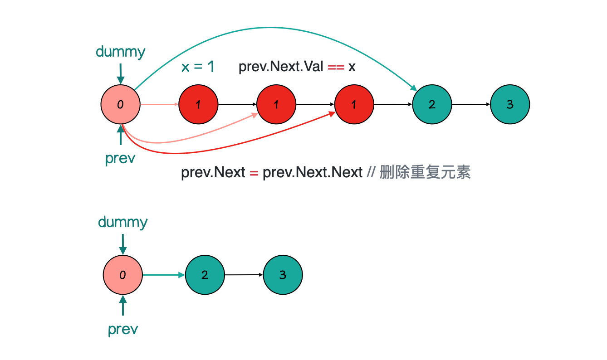

1. [72. 编辑距离](#72-编辑距离)
2. [69. x 的平方根](#69-x-的平方根)
3. [2. 两数相加](#2-两数相加)
4. [82. 删除排序链表中的重复元素 II](#82-删除排序链表中的重复元素-ii)
5. [31. 下一个排列](#31-下一个排列)
6. [剑指 Offer 22. 链表中倒数第k个节点](#剑指-offer-22-链表中倒数第k个节点)
7. [22. 括号生成](#22-括号生成)
8. [8. 字符串转换整数 (atoi)](#8-字符串转换整数-atoi)
9. [1143. 最长公共子序列](#1143-最长公共子序列)
10. [41. 缺失的第一个正数](#41-缺失的第一个正数)


## [72. 编辑距离](https://leetcode-cn.com/problems/edit-distance/) 

```go

```

## [69. x 的平方根](https://leetcode-cn.com/problems/sqrtx/)

**方法一：二分查找**

```go
func mySqrt(x int) int {
    l, r, res := 0, x, 0
    for l <= r {
        mid := l + (r-l)>>1
        if mid*mid <= x {
            res = mid
            l = mid + 1
        } else {
            r = mid - 1
        }
    }
    return res
}
```
复杂度分析

- 时间复杂度：O(logx)，即为二分查找需要的次数。
- 空间复杂度：O(1)。


## [2. 两数相加](https://leetcode-cn.com/problems/add-two-numbers/)


```go
/**
 * Definition for singly-linked list.
 * type ListNode struct {
 *     Val int
 *     Next *ListNode
 * }
 */
func addTwoNumbers(l1 *ListNode, l2 *ListNode) *ListNode {
	dummy := new(ListNode)
	curr,carry := dummy, 0
	for l1 != nil || l2 != nil || carry > 0 {
		curr.Next = new(ListNode) // 新建一个节点存储计算结果
		curr = curr.Next // 将计算结果连接成链表
		if l1 != nil {
			carry += l1.Val
			l1 = l1.Next
		}
		if l2 != nil {
			carry += l2.Val
			l2 = l2.Next
		}
		curr.Val = carry % 10
		carry /= 10
	}
	return dummy.Next
}
```


## [82. 删除排序链表中的重复元素 II](https://leetcode-cn.com/problems/remove-duplicates-from-sorted-list-ii/)





```go
/**
 * Definition for singly-linked list.
 * type ListNode struct {
 *     Val int
 *     Next *ListNode
 * }
 */
func deleteDuplicates(head *ListNode) *ListNode {
	dummy := &ListNode{0, head}
	prev := dummy
	for prev.Next != nil && prev.Next.Next != nil {
		if prev.Next.Val == prev.Next.Next.Val {
			x := prev.Next.Val // 记录重复元素
			for prev.Next != nil && prev.Next.Val == x {
				prev.Next = prev.Next.Next // 删除重复元素
			}
		} else {
			prev = prev.Next
		}
	}
	return dummy.Next
}
```


## [31. 下一个排列](https://leetcode-cn.com/problems/next-permutation/)

```go
func nextPermutation(nums []int) {
	i := len(nums) - 2                   // 向左遍历，i从倒数第二开始是为了nums[i+1]要存在
	for i >= 0 && nums[i] >= nums[i+1] { // 寻找第一个小于右邻居的数
		i--
	}
	if i >= 0 { // 这个数在数组中存在，从它身后挑一个数，和它换
		j := len(nums) - 1                 // 从最后一项，向左遍历
		for j >= 0 && nums[j] <= nums[i] { // 寻找第一个大于 nums[i] 的数
			j--
		}
		nums[i], nums[j] = nums[j], nums[i] // 两数交换，实现变大
	}
	// 如果 i = -1，说明是递减排列，如 3 2 1，没有下一排列，直接翻转为最小排列：1 2 3
	l, r := i+1, len(nums)-1
	for l < r { // i 右边的数进行翻转，使得变大的幅度小一些
		nums[l], nums[r] = nums[r], nums[l]
		l++
		r--
	}
}
```


## [剑指 Offer 22. 链表中倒数第k个节点](https://leetcode-cn.com/problems/lian-biao-zhong-dao-shu-di-kge-jie-dian-lcof/)

```go
/**
 * Definition for singly-linked list.
 * type ListNode struct {
 *     Val int
 *     Next *ListNode
 * }
 */
func getKthFromEnd(head *ListNode, k int) *ListNode {
    slow, fast := head, head
    for i := 0; fast != nil; i++ {
        if i >= k {
            slow = slow.Next
        }
        fast = fast.Next
    }
    return slow
}
```


```go
/**
 * Definition for singly-linked list.
 * type ListNode struct {
 *     Val int
 *     Next *ListNode
 * }
 */
func getKthFromEnd(head *ListNode, k int) *ListNode {
    slow, fast := head, head
    for ; fast != nil && k > 0; k-- {
        fast = fast.Next
    }
    for fast != nil {
        slow = slow.Next
        fast = fast.Next
    }
    return slow
}
```


## [22. 括号生成](https://leetcode-cn.com/problems/generate-parentheses/)

```go
func generateParenthesis(n int) (res []string) {
	var dfs func(int, int, string)
	dfs = func(left, right int, path string) {
		if len(path) == 2*n { // 一个合法解已生成
			res = append(res, path) // 加入解集
			return
		}
		if left > 0 { // 左括号只要有剩余就可以选左括号
			dfs(left-1, right, path+"(")
		}
		if right > left { // 右括号数量大于左括号，才可以选右括号
			dfs(left, right-1, path+")")
		}
	}
	dfs(n, n, "")
	return
}
```

## [8. 字符串转换整数 (atoi)](https://leetcode-cn.com/problems/string-to-integer-atoi/) 

```go
func myAtoi(s string) int {
	abs, i, sign, n := 0, 0, 1, len(s)
	for i < n && s[i] == ' ' { //丢弃无用的前导空格
		i++
	}
	if i < n {
		if s[i] == '-' { //标记正负号
			sign = -1
			i++
		} else if s[i] == '+' {
			sign = 1
			i++
		}
	}
	for i < n && s[i] >= '0' && s[i] <= '9' {
		abs = 10*abs + int(s[i]-'0')  //字节 byte '0' == 48
		if sign*abs < math.MinInt32 { //整数超过 32 位有符号整数范围
			return math.MinInt32
		} else if sign*abs > math.MaxInt32 {
			return math.MaxInt32
		}
		i++
	}
	return sign * abs
}
```

## [1143. 最长公共子序列](https://leetcode-cn.com/problems/longest-common-subsequence/)


```go
func longestCommonSubsequence(text1 string, text2 string) int {
	m, n := len(text1), len(text2)
	dp := make([][]int, m+1) // 创建二维数组
	for i := range dp {
		dp[i] = make([]int, n+1)
	}
	for i := 1; i <= m; i++ {
		for j := 1; j <= n; j++ {
			if text1[i-1] == text2[j-1] { // 不减1会下标越界
				dp[i][j] = dp[i-1][j-1] + 1
			} else {
				dp[i][j] = max(dp[i-1][j], dp[i][j-1])
			}
		}
	}
	return dp[m][n]
}
func max(x, y int) int {
	if x > y {
		return x
	}
	return y
}
```


## [41. 缺失的第一个正数](https://leetcode-cn.com/problems/first-missing-positive/)


```go
func firstMissingPositive(nums []int) int {
    n := len(nums)
    hash := make(map[int]int, n)
    for _,v := range nums {
        hash[v] = v
    }
    for i := 1; i <= n; i++ {
        if _,ok := hash[i]; !ok {
            return i
        }
    }
    return n+1
}
```


```go
func firstMissingPositive(nums []int) int {
	n := len(nums)
	for _, x := range nums {
		for x > 0 && x <= n && nums[x-1] != x {
			nums[x-1], x = x, nums[x-1]
		}
	}
	for i, x := range nums {
		if x != i+1 {
			return i + 1
		}
	}
	return n + 1
}
```

