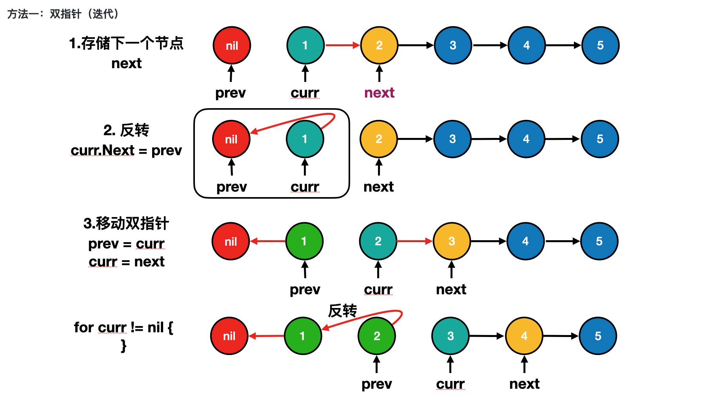
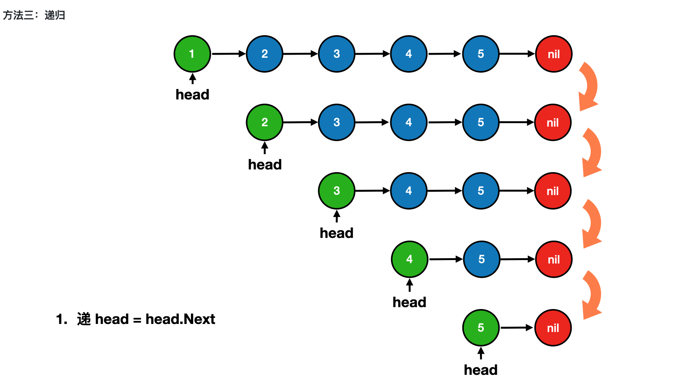
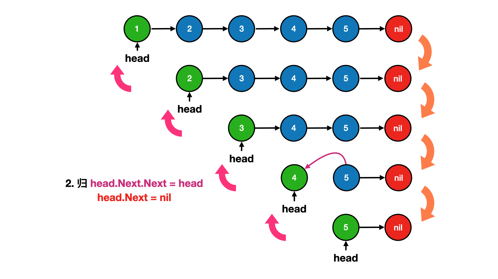
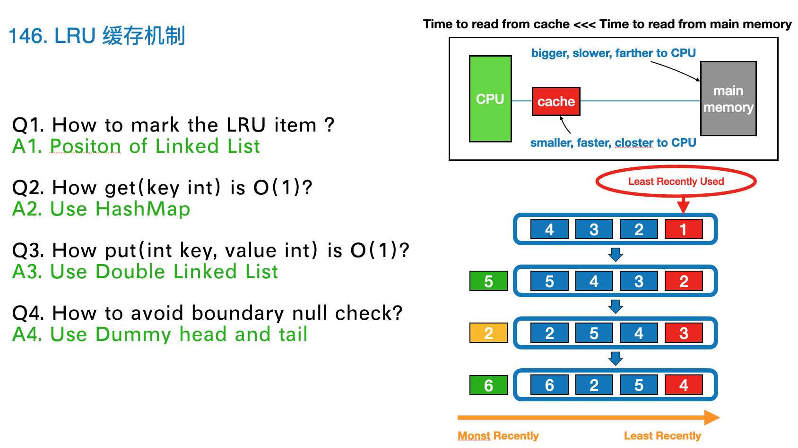
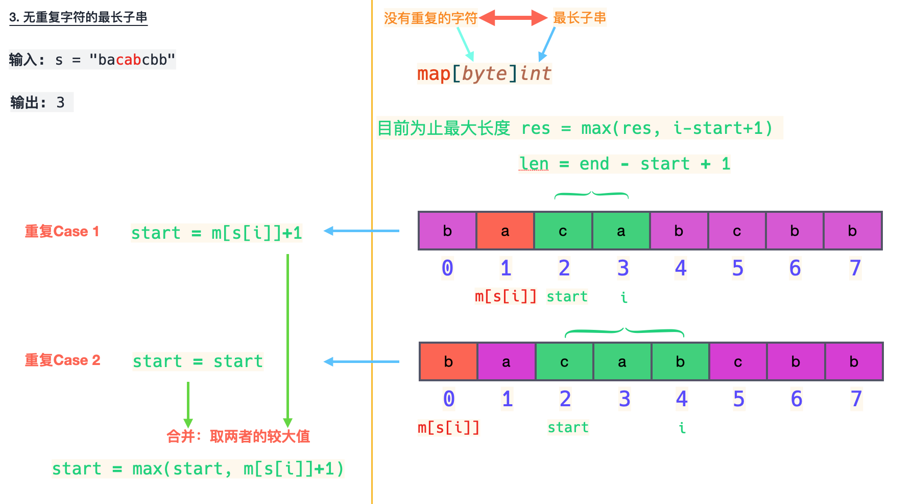
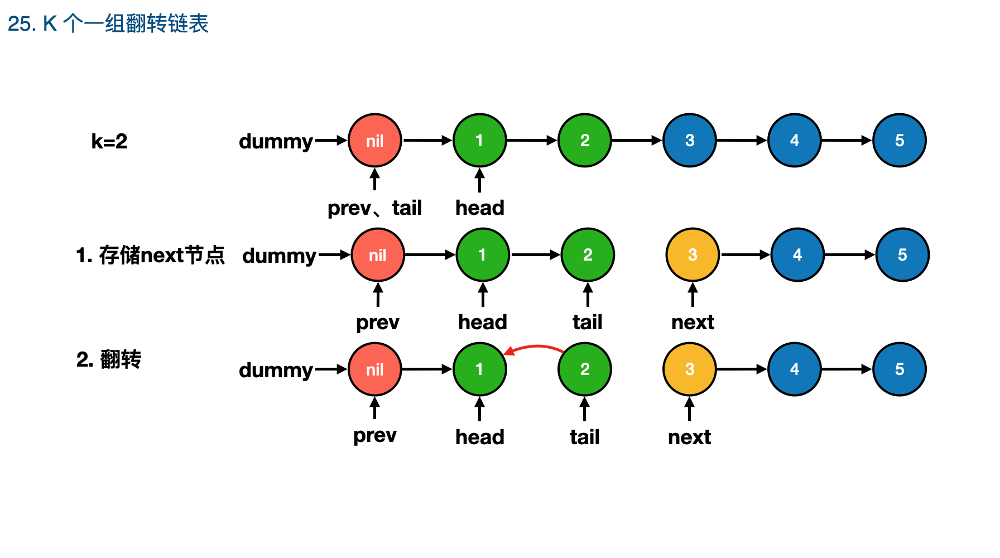
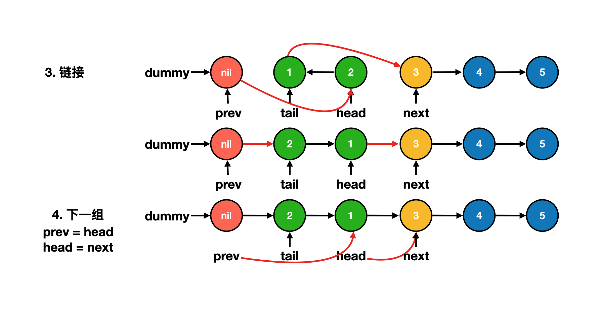
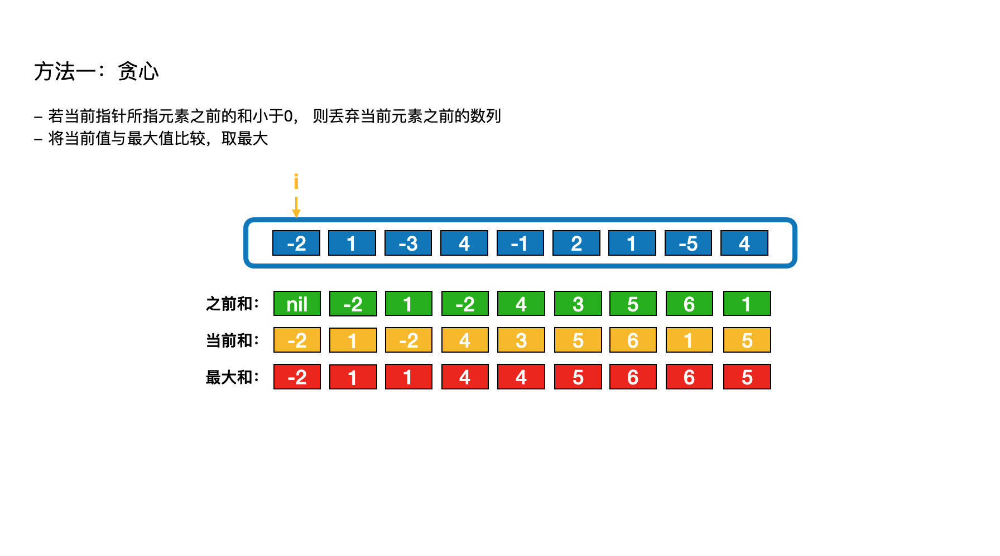
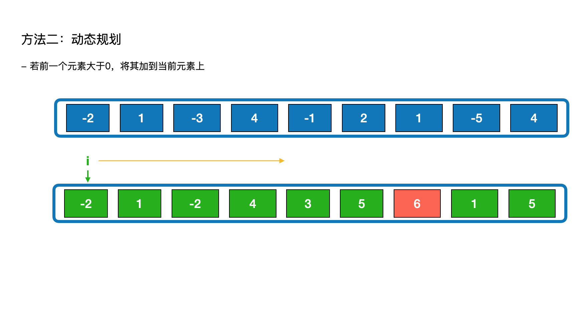
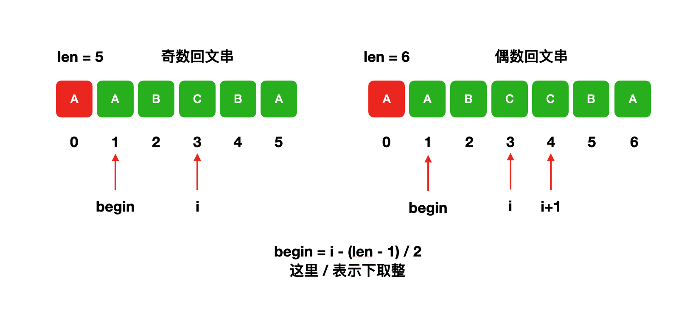

1. [206. 反转链表](#206-反转链表)
2. [146. LRU 缓存机制](#146-lru-缓存机制)
3. [3. 无重复字符的最长子串](#3-无重复字符的最长子串)
4. [215. 数组中的第K个最大元素](#215-数组中的第k个最大元素)
5. [25. K 个一组翻转链表](#25-k-个一组翻转链表)
6. [补充题4. 手撕快速排序 912. 排序数组 ](#补充题4-手撕快速排序-912-排序数组-)
7. [15. 三数之和](#15-三数之和)
8. [53. 最大子序和](#53-最大子序和)
9. [1. 两数之和](#1-两数之和)
10. [21. 合并两个有序链表](#21-合并两个有序链表)
11. [141. 环形链表](#141-环形链表)
12. [102. 二叉树的层序遍历](#102-二叉树的层序遍历)
13. [121. 买卖股票的最佳时机](#121-买卖股票的最佳时机)
14. [160. 相交链表](#160-相交链表)
15. [88. 合并两个有序数组](#88-合并两个有序数组)
16. [103. 二叉树的锯齿形层序遍历](#103-二叉树的锯齿形层序遍历)
17. [20. 有效的括号](#20-有效的括号)
18. [236. 二叉树的最近公共祖先](#236-二叉树的最近公共祖先)
19. [5. 最长回文子串](#5-最长回文子串)
20. [415. 字符串相加](#415-字符串相加)


<!-- 

[206. 反转链表](https://leetcode-cn.com/problems/reverse-linked-list/) 

[146. LRU 缓存机制](https://leetcode-cn.com/problems/lru-cache/)

[3. 无重复字符的最长子串](https://leetcode-cn.com/problems/longest-substring-without-repeating-characters/)

[215. 数组中的第K个最大元素](https://leetcode-cn.com/problems/kth-largest-element-in-an-array/)

[25. K 个一组翻转链表](https://leetcode-cn.com/problems/reverse-nodes-in-k-group/)

[补充题4. 手撕快速排序 912. 排序数组](https://leetcode-cn.com/problems/sort-an-array/)

[15. 三数之和](https://leetcode-cn.com/problems/3sum/)

[53. 最大子序和](https://leetcode-cn.com/problems/maximum-subarray/)

[1. 两数之和](https://leetcode-cn.com/problems/two-sum/)

[21. 合并两个有序链表](https://leetcode-cn.com/problems/merge-two-sorted-lists/)

-->

------


## [206. 反转链表](https://leetcode-cn.com/problems/reverse-linked-list/) 


<!-- **方法一：迭代（双指针）** -->




思路：在遍历链表时，将当前节点的 next 指针改为指向前一个节点。由于节点没有引用其前一个节点，因此必须事先存储其前一个节点。在更改引用之前，还需要存储后一个节点。最后返回新的头引用。


``` go
/**
 * Definition for singly-linked list.
 * type ListNode struct {
 *     Val int
 *     Next *ListNode
 * }
 */
func reverseList(head *ListNode) *ListNode {
	var prev *ListNode //prev -> nil
	curr := head
	for curr != nil {	  //当前节点不为空
		next := curr.Next //1.存储下一个节点
		curr.Next = prev  //2.当前节点的next指针指向前一个节点
		prev = curr       //3.移动双指针
		curr = next
	}
	return prev
}
```

复杂度分析

- 时间复杂度：O(n)，其中 n 是链表的长度。需要遍历链表一次。

- 空间复杂度：O(1)。


<!-- **方法二：头插法** -->


``` go
/**
 * Definition for singly-linked list.
 * type ListNode struct {
 *     Val int
 *     Next *ListNode
 * }
 */
func reverseList(head *ListNode) *ListNode {
	//没有节点或只有一个节点
	if head == nil || head.Next == nil {
		return head
	} //dummy->curr->next	 nil->1->2	->3
	dummy, curr := &ListNode{Next: head}, head
	for curr.Next != nil {
		next := curr.Next
		curr.Next = next.Next  //找到后继节点 1->3
		next.Next = dummy.Next //头插/反转 2->1
		dummy.Next = next      //通知哨兵 dummy-> 2->1->3
	} 
	return dummy.Next
}
```


<!-- **方法三：递归** -->

)
)


**思路**

1. 大问题拆解成2个子问题：
2. 子问题的求解方式和大问题一样
3. 存在最小子问题：只有一个节点，反转没有意义，直接返回


``` go
/**
 * Definition for singly-linked list.
 * type ListNode struct {
 *     Val int
 *     Next *ListNode
 * }
 */
func reverseList(head *ListNode) *ListNode {
	if head == nil || head.Next == nil { // 最小子问题
		return head
	}
	newHead := reverseList(head.Next) // 递：1->2->3->4->5->nil 
	head.Next.Next = head             // 归：5->4
	head.Next = nil                   // 4->nil
	return newHead
}
```

复杂度分析

- 时间复杂度：O(n)，其中 n 是链表的长度。需要对链表的每个节点进行反转操作。

- 空间复杂度：O(n)，其中 n 是链表的长度。空间复杂度主要取决于递归调用的栈空间，最多为 n 层。


## [146. LRU 缓存机制](https://leetcode-cn.com/problems/lru-cache/)



**方法一：哈希表 + 双向链表**
算法

LRU 缓存机制可以通过哈希表辅以双向链表实现，我们用一个哈希表和一个双向链表维护所有在缓存中的键值对。

- <font  style="background-color:#00CC66; font-size:23px; font-family: 'HanziPen SC' ">双向链表按照被使用的顺序存储了这些键值对，靠近头部的键值对是最近使用的，而靠近尾部的键值对是最久未使用的。</font>

- <font  style="background-color:#00CC66; font-size:23px; font-family: 'HanziPen SC' ">哈希表即为普通的哈希映射（HashMap），通过缓存数据的键映射到其在双向链表中的位置。</font>

这样以来，我们首先使用哈希表进行定位，找出缓存项在双向链表中的位置，随后将其移动到双向链表的头部，即可在 O(1) 的时间内完成 get 或者 put 操作。具体的方法如下：

- 对于 get 操作，首先判断 key 是否存在：

    如果 key 不存在，则返回 −1；

    如果 key 存在，则 key 对应的节点是最近被使用的节点。通过哈希表定位到该节点在双向链表中的位置，并将其移动到双向链表的头部，最后返回该节点的值。

- 对于 put 操作，首先判断 key 是否存在：

    如果 key 不存在，使用 key 和 value 创建一个新的节点，在双向链表的头部添加该节点，并将 key 和该节点添加进哈希表中。然后判断双向链表的节点数是否超出容量，如果超出容量，则删除双向链表的尾部节点，并删除哈希表中对应的项；

    如果 key 存在，则与 get 操作类似，先通过哈希表定位，再将对应的节点的值更新为 value，并将该节点移到双向链表的头部。

上述各项操作中，访问哈希表的时间复杂度为 (1)，在双向链表的头部添加节点、在双向链表的尾部删除节点的复杂度也为 O(1)。而将一个节点移到双向链表的头部，可以分成「删除该节点」和「在双向链表的头部添加节点」两步操作，都可以在 O(1) 时间内完成。

小贴士

在双向链表的实现中，使用一个伪头部（dummy head）和伪尾部（dummy tail）标记界限，这样在添加节点和删除节点的时候就不需要检查相邻的节点是否存在。


```go
type LRUCache struct {
	cache          map[int]*DLinkedNode
	head, tail     *DLinkedNode
	size, capacity int
}

type DLinkedNode struct {
	key, value int
	prev, next *DLinkedNode
}

func initDLinkedNode(key, value int) *DLinkedNode {
	return &DLinkedNode{
		key:   key,
		value: value,
	}
}

func Constructor(capacity int) LRUCache {
	l := LRUCache{
		cache:    map[int]*DLinkedNode{},
		head:     initDLinkedNode(0, 0),
		tail:     initDLinkedNode(0, 0),
		capacity: capacity,
	}
	l.head.next = l.tail
	l.tail.prev = l.head
	return l
}

func (this *LRUCache) Get(key int) int {
	if _, ok := this.cache[key]; !ok {
		return -1
	}
	node := this.cache[key] // 如果 key 存在，先通过哈希表定位，再移到头部
	this.moveToHead(node)
	return node.value
}

func (this *LRUCache) Put(key int, value int) {
	if _, ok := this.cache[key]; !ok { // 如果 key 不存在，创建一个新的节点
		node := initDLinkedNode(key, value)
		this.cache[key] = node // 添加进哈希表
		this.addToHead(node)   // 添加至双向链表的头部
		this.size++
		if this.size > this.capacity {
			removed := this.removeTail()    // 如果超出容量，删除双向链表的尾部节点
			delete(this.cache, removed.key) // 删除哈希表中对应的项
			this.size--
		}
	} else { // 如果 key 存在，先通过哈希表定位，再修改 value，并移到头部
		node := this.cache[key]
		node.value = value
		this.moveToHead(node)
	}
}

func (this *LRUCache) addToHead(node *DLinkedNode) {
	node.prev = this.head
	node.next = this.head.next
	this.head.next.prev = node
	this.head.next = node
}

func (this *LRUCache) removeNode(node *DLinkedNode) {
	node.prev.next = node.next
	node.next.prev = node.prev
}

func (this *LRUCache) moveToHead(node *DLinkedNode) {
	this.removeNode(node)
	this.addToHead(node)
}

func (this *LRUCache) removeTail() *DLinkedNode {
	node := this.tail.prev
	this.removeNode(node)
	return node
}

/**
 * Your LRUCache object will be instantiated and called as such:
 * obj := Constructor(capacity);
 * param_1 := obj.Get(key);
 * obj.Put(key,value);
 */
```

复杂度分析

时间复杂度：对于 put 和 get 都是 O(1)。

空间复杂度：O(capacity)，因为哈希表和双向链表最多存储 capacity+1 个元素。

[参考](https://www.bilibili.com/video/BV12z4y1o7jy)

[参考](https://leetcode-cn.com/problems/lru-cache/solution/lruhuan-cun-ji-zhi-by-leetcode-solution/)


## [3. 无重复字符的最长子串](https://leetcode-cn.com/problems/longest-substring-without-repeating-characters/)


**方法一：双指针 O(n)**

1. (a)bcabcbb
2. (ab)cabcbb 
3. (abc)abcbb
4. (abca)bcbb 当前字符和首字符重复
5. ~~a~~(bca)bcbb 删除首字符（收缩窗口）
6. ~~a~~(bcab)cbb 继续向后扫描（扩展窗口）
7. ~~ab~~(cab)cbb

思路：定义两个指针 i,j(i<=j)，表示当前扫描到的子串是 [i,j](闭区间)。扫描过程中维护一个哈希表 hash := map[byte]int{}，表示 [i,j]中每个字符出现的次数。线性扫描时，每次循环的流程如下：

1. 指针 j 向后移一位, 同时将哈希表中 s[j] 的计数加一: hash[s[j]]++;
2. 假设 j 移动前的区间 [i,j] 中没有重复字符，则 j 移动后，只有 s[j] 可能出现2次。因此我们不断向后移动 i，直至区间 [i,j] 中 s[j] 的个数等于1为止；
   
复杂度分析：由于 i,j 均最多增加n次，且哈希表的插入和更新操作的复杂度都是 O(1)，因此，总时间复杂度 O(n)


``` go
func lengthOfLongestSubstring(s string) int {
	hash := map[byte]int{} // 哈希集合记录每个字符出现次数
	res := 0
	for i, j := 0, 0; j < len(s); j++ {
		hash[s[j]]++                // 首次存入哈希
		for ; hash[s[j]] > 1; i++ { // 出现字符和首字符重复，i++跳过首字符(收缩窗口)
			hash[s[i]]-- // 哈希记录次数减1
		}
		res = max(res, j-i+1) // 统计无重复字符的最长子串
	}
	return res
}
func max(x, y int) int {
	if x < y {
		return y
	}
	return x
}
```
[参考](https://www.acwing.com/solution/content/49/)


**方法二：双指针 / 滑动窗口**




``` go
func lengthOfLongestSubstring(s string) (res int) {
	m := map[byte]int{} // 无重复字符的最长下标
	start := 0          // 无重复字符的起点下标
	for i := 0; i < len(s); i++ { // 扩展窗口
		if _, exists := m[s[i]]; exists { // 有重复字符
			start = max(start, m[s[i]]+1) // 取index较大值作为起点（收缩窗口）
		}
		m[s[i]] = i               // 无重复字符，加入map
		res = max(res, i-start+1) // 统计目前无重复字符的最大长度
	}
	return
}
func max(x, y int) int {
	if x > y {
		return x
	}
	return y
}
```


```go
func lengthOfLongestSubstring(s string) int {
	m := map[rune]int{}
	res, start := 0, 0
	for i, x := range s {
		if _, ok := m[x]; ok {
			start = max(start, m[x]+1)
		}
		m[x] = i
		res = max(res, i-start+1)
	}
	return res
}

func max(x, y int) int {
	if x > y {
		return x
	}
	return y
}
```


- T(n) = O(n)
- S(n) = O(|Σ|) 其中 Σ 表示字符集（即字符串中可以出现的字符），∣Σ∣ 表示字符集的大小。


[参考](https://www.bilibili.com/video/BV1ub4y1d7Z8)


## [215. 数组中的第K个最大元素](https://leetcode-cn.com/problems/kth-largest-element-in-an-array/)


**方法一：基于快速排序的选择方法**

快速选择算法思路：

只要某次划分的 q 为倒数第 k 个下标的时候，我们就已经找到了答案。
如果划分得到的 q 正好就是我们需要的下标，就直接返回 a[q]；
否则，如果 q 比目标下标小，就递归右子区间，否则递归左子区间。

``` go
func findKthLargest(A []int, k int) int {
	n := len(A)
	return quickSelect(A, 0, n-1, n-k)
}
func quickSelect(A []int, l, r, k int) int {
	if l == r {
		return A[k]
	}
	partition := A[l+(r-l)>>1] // A[(l+r)/2]
	i, j := l-1, r+1
	for i < j {
		for i++; A[i] < partition; i++ {
		}
		for j--; A[j] > partition; j-- {
		}
		if i < j {
			A[i], A[j] = A[j], A[i]
		}
	}
	if k <= j {
		return quickSelect(A, l, j, k)
	} else {
		return quickSelect(A, j+1, r, k)
	}
}
```


复杂度分析

- 时间复杂度：O(n)，如上文所述，证明过程可以参考「《算法导论》9.2：期望为线性的选择算法」。
- 空间复杂度：O(logn)，递归使用栈空间的空间代价的期望为 O(logn)。


* 考点1：能否实现解法的优化
* 考点2：是否了解快速选择算法
* 考点3：能否说明堆算法和快速选择算法的适用场景


**方法二：基于堆排序的选择方法**

思路和算法

建立一个大根堆，做 k - 1 次删除操作后堆顶元素就是我们要找的答案。

``` go
func findKthLargest(A []int, k int) int {
	heap_size, n := len(A), len(A)
	build_maxheap(A, heap_size)
	for i := heap_size - 1; i >= n-k+1; i-- {
		A[0], A[i] = A[i], A[0]
		heap_size--
		max_heapify(A, 0, heap_size)
	}
	return A[0]
}
func build_maxheap(A []int, heap_size int) {
	for i := heap_size >> 1; i >= 0; i-- {
		max_heapify(A, i, heap_size)
	}
}
func max_heapify(A []int, i, heap_size int) {
	lson, rson, largest := i<<1+1, i<<1+2, i
	if lson < heap_size && A[largest] < A[lson] {
		largest = lson
	}
	if rson < heap_size && A[largest] < A[rson] {
		largest = rson
	}
	if i != largest {
		A[i], A[largest] = A[largest], A[i]
		max_heapify(A, largest, heap_size)
	}
}
```

复杂度分析

- 时间复杂度：O(nlogn)，建堆的时间代价是 O(n)，删除的总代价是 O(klogn)，因为 k < n，故渐进时间复杂为 O(n+klogn)=O(nlogn)。
- 空间复杂度：O(logn)，即递归使用栈空间的空间代价。


## [25. K 个一组翻转链表](https://leetcode-cn.com/problems/reverse-nodes-in-k-group/)




``` go
/**
 * Definition for singly-linked list.
 * type ListNode struct {
 *     Val int
 *     Next *ListNode
 * }
 */
func reverseKGroup(head *ListNode, k int) *ListNode {
	dummy := &ListNode{Next: head}
	prev := dummy
	for head != nil {
		tail := prev
		for i := 0; i < k; i++ {
			tail = tail.Next
			if tail == nil {
				return dummy.Next
			}
		}
		next := tail.Next
		tail.Next = nil
		prev.Next = reverse(head)
		head.Next = next
		prev = head
		head = next
	}
	return dummy.Next
}

func reverse(head *ListNode) *ListNode {
	var prev *ListNode
	curr := head
	for curr != nil {
		next := curr.Next
		curr.Next = prev
		prev = curr
		curr = next
	}
	return prev
}
```


复杂度分析

- 时间复杂度：O(n)，其中 n 为链表的长度。head 指针会在 O(⌊k/n⌋) 个节点上停留，每次停留需要进行一次 O(k) 的翻转操作。

- 空间复杂度：O(1)，我们只需要建立常数个变量。


## [补充题4. 手撕快速排序 912. 排序数组 ](https://leetcode-cn.com/problems/sort-an-array/)


**方法一：快速排序**

思路和算法

快速排序的主要思想是通过划分将待排序的序列分成前后两部分，其中前一部分的数据都比后一部分的数据要小，
然后再递归调用函数对两部分的序列分别进行快速排序，以此使整个序列达到有序。

快排思路：
1. 确定分界点 x：q[l], q[r], q[(l+r)>>1], 随机
2. 调整区间：left <= x, right >= x
3. 递归处理左右两边

- 时间复杂度： O(nlog(n)) 
- 空间复杂度： O(log(n)), 递归使用栈空间的空间代价为O(logn)。

``` go
func sortArray(nums []int) []int {
	rand.Seed(time.Now().UnixNano())
	quick_sort(nums, 0, len(nums)-1)
	return nums
}

func quick_sort(A []int, start, end int) {
	if start < end {
		piv_pos := random_partition(A, start, end)
		quick_sort(A, start, piv_pos-1)
		quick_sort(A, piv_pos+1, end)
	}
}

func partition(A []int, start, end int) int {
	piv, i := A[start], start+1
	for j := start + 1; j <= end; j++ {
		if A[j] < piv {
			A[i], A[j] = A[j], A[i]
			i++
		}
	}
	A[start], A[i-1] = A[i-1], A[start]
	return i - 1
}

func random_partition(A []int, start, end int) int {
	random := rand.Int()%(end-start+1) + start
	A[start], A[random] = A[random], A[start]
	return partition(A, start, end)
}
```

复杂度分析

- 时间复杂度：基于随机选取主元的快速排序时间复杂度为期望 O(nlogn)，其中 n 为数组的长度。详细证明过程可以见《算法导论》第七章，这里不再大篇幅赘述。

- 空间复杂度：O(h)，其中 h 为快速排序递归调用的层数。我们需要额外的 O(h) 的递归调用的栈空间，由于划分的结果不同导致了快速排序递归调用的层数也会不同，最坏情况下需 O(n) 的空间，最优情况下每次都平衡，此时整个递归树高度为 logn，空间复杂度为 O(logn)。


[参考](https://www.hackerearth.com/practice/algorithms/sorting/quick-sort/tutorial/)


## [15. 三数之和](https://leetcode-cn.com/problems/3sum/)

**思路**

外层循环：指针 i 遍历数组。
内层循环：用双指针，去寻找满足三数之和等于 0 的元素

**先排序的意义**
便于跳过重复元素，如果当前元素和前一个元素相同，跳过。

**双指针的移动时，避免出现重复解**

找到一个解后，左右指针同时向内收缩，为了避免指向重复的元素，需要：

- 左指针在保证left < right的前提下，一直右移，直到指向不重复的元素
- 右指针在保证left < right的前提下，一直左移，直到指向不重复的元素

**小优化**

排序后，如果外层遍历的数已经大于0，则另外两个数一定大于0，sum不会等于0，直接break。


```go
func threeSum(nums []int) [][]int {
	sort.Ints(nums)
	res := [][]int{}
	for i := 0; i < len(nums)-2; i++ {
		n1 := nums[i]
		if n1 > 0 { //如果最小的数大于0，break
			break
		}
		if i > 0 && n1 == nums[i-1] { //如果和前一个相同，跳过
			continue
		}
		start, end := i+1, len(nums)-1 //转换为两数之和，双指针解法
		for start < end {
			n2, n3 := nums[start], nums[end]
			if n1+n2+n3 == 0 {
				res = append(res, []int{n1, n2, n3})
				for start < end && nums[start] == n2 { //去重移位
					start++
				}
				for start < end && nums[end] == n3 {
					end--
				}
			} else if n1+n2+n3 < 0 {
				start++
			} else {
				end--
			}
		}
	}
	return res
}
```

复杂度分析

- 时间复杂度：O(N^2)，其中 N 是数组 nums 的长度。

- 空间复杂度：O(logN)。我们忽略存储答案的空间，额外的排序的空间复杂度为 O(logN)。然而我们修改了输入的数组 nums，在实际情况下不一定允许，因此也可以看成使用了一个额外的数组存储了 nums 的副本并进行排序，空间复杂度为 O(N)。


## [53. 最大子序和](https://leetcode-cn.com/problems/maximum-subarray/)

**方法一：贪心**

1. 若当前指针所指元素之前的和小于0， 则丢弃当前元素之前的数列 
2. 将当前值与最大值比较，取最大




```go
func maxSubArray(nums []int) int {
	prev, maxSum := 0, nums[0]
	for _, curr := range nums {
		// 若当前指针所指元素之前的和小于0，则丢弃当前元素之前的数列
		prev = max(prev+curr, curr)
		// 将当前值与最大值比较，取最大
		maxSum = max(maxSum, prev)
	}
	return maxSum
}
```


**方法二：动态规划**

- 若前一个元素大于0，将其加到当前元素上




```go
func maxSubArray(nums []int) int {
	maxSum := nums[0]
	for i := 1; i < len(nums); i++ {
		if nums[i-1]+nums[i] > nums[i] { // 若前一个元素大于0，将其加到当前元素上
			nums[i] += nums[i-1] // nums[i-1] > 0
		}
		maxSum = max(maxSum, nums[i])
	}
	return maxSum
}
```

*复杂度*

- 时间复杂度：O(n)，其中 n 为 nums 数组的长度。我们只需要遍历一遍数组即可求得答案。
- 空间复杂度：O(1)。我们只需要常数空间存放若干变量。


## [1. 两数之和](https://leetcode-cn.com/problems/two-sum/)


**方法一：暴力枚举**

思路及算法

最容易想到的方法是枚举数组中的每一个数 x，寻找数组中是否存在 target - x。

``` go
func twoSum(nums []int, target int) []int {
	for i, x := range nums {
		for j := i + 1; j < len(nums); j++ {
			if x+nums[j] == target {
				return []int{i, j}
			}
		}
	}
	return nil
}
```
**方法二：哈希表**

思路及算法

使用哈希表，可以将寻找 target - x 的时间复杂度降低到从 O(N) 降低到 O(1)。

**查找表法**

- 在遍历的同时，记录一些信息，以省去一层循环，这是以空间换时间的想法
- 需要记录已经遍历过的数值和他所对应的下标，可以借鉴查找表实现
- 查找表有2个常用的实现：
1. 哈希表
2. 平衡二叉搜索树


``` go
func twoSum(nums []int, target int) []int {
	hashTable := map[int]int{}
	for i, x := range nums {
		if p, ok := hashTable[target-x]; ok {
			return []int{p, i}
		}
		hashTable[x] = i
	}
	return nil
}
```


*Data Structure:*
- HashMap:<num, the index of the num>

**Algorithm:**

从头开始遍历数组：
1. 在map里找到当前这个数的另一半，返回
2. 没找到，存入map, key为数， value为index

- Solution:先找到另一半，没有就存入
- Why HashMap ?

存储 num 和 index 的关系，便于快速查找

Any Detial?
- 找到答案就break结束
- 先查找另一半，再存入，避免和自己相加


## [21. 合并两个有序链表](https://leetcode-cn.com/problems/merge-two-sorted-lists/)


*方法一：递归*

``` go
/**
 * Definition for singly-linked list.
 * type ListNode struct {
 *     Val int
 *     Next *ListNode
 * }
 */
func mergeTwoLists(l1 *ListNode, l2 *ListNode) *ListNode {
	if l1 == nil {
		return l2
	}
	if l2 == nil {
		return l1
	}
	if l1.Val < l2.Val {
		l1.Next = mergeTwoLists(l1.Next, l2)
		return l1
	} else {
		l2.Next = mergeTwoLists(l1, l2.Next)
		return l2
	}
}
```

*复杂度分析*

- 时间复杂度：O(n+m)，其中 n 和 m 分别为两个链表的长度。因为每次调用递归都会去掉 l1 或者 l2 的头节点（直到至少有一个链表为空），函数 mergeTwoList 至多只会递归调用每个节点一次。因此，时间复杂度取决于合并后的链表长度，即 O(n+m)。
- 空间复杂度：O(n+m)，其中 n 和 m 分别为两个链表的长度。递归调用 mergeTwoLists 函数时需要消耗栈空间，栈空间的大小取决于递归调用的深度。结束递归调用时 mergeTwoLists 函数最多调用 n+m 次，因此空间复杂度为 O(n+m)。


*方法二：迭代*

当 l1 和 l2 都不是空链表时，判断 l1 和 l2 哪一个链表的头节点的值更小，将较小值的节点添加到结果里，当一个节点被添加到结果里之后，将对应链表中的节点向后移一位。


``` go
/**
 * Definition for singly-linked list.
 * type ListNode struct {
 *     Val int
 *     Next *ListNode
 * }
 */
func mergeTwoLists(l1 *ListNode, l2 *ListNode) *ListNode {
	dummy := new(ListNode)
	prev := dummy
	for l1 != nil && l2 != nil {
		if l1.Val < l2.Val {
			prev.Next = l1
			l1 = l1.Next
		} else {
			prev.Next = l2
			l2 = l2.Next
		}
		prev = prev.Next
	}
	if l1 != nil {
		prev.Next = l1
	} else {
		prev.Next = l2
	}
	return dummy.Next
}
```


*复杂度分析*

- 时间复杂度：O(n+m)，其中 n 和 m 分别为两个链表的长度。因为每次循环迭代中，l1 和 l2 只有一个元素会被放进合并链表中， 因此 while 循环的次数不会超过两个链表的长度之和。所有其他操作的时间复杂度都是常数级别的，因此总的时间复杂度为 O(n+m)。
- 空间复杂度：O(1)。我们只需要常数的空间存放若干变量。


---


<!-- 
[141. 环形链表](https://leetcode-cn.com/problems/linked-list-cycle/)

[102. 二叉树的层序遍历](https://leetcode-cn.com/problems/binary-tree-level-order-traversal/)

[121. 买卖股票的最佳时机](https://leetcode-cn.com/problems/best-time-to-buy-and-sell-stock/)

[160. 相交链表](https://leetcode-cn.com/problems/intersection-of-two-linked-lists/)

[88. 合并两个有序数组](https://leetcode-cn.com/problems/merge-sorted-array/)

[103. 二叉树的锯齿形层序遍历](https://leetcode-cn.com/problems/binary-tree-zigzag-level-order-traversal/)

[20. 有效的括号](https://leetcode-cn.com/problems/valid-parentheses/)

[236. 二叉树的最近公共祖先](https://leetcode-cn.com/problems/lowest-common-ancestor-of-a-binary-tree/)

[5. 最长回文子串](https://leetcode-cn.com/problems/longest-palindromic-substring/)

[415. 字符串相加](https://leetcode-cn.com/problems/add-strings/)

-->

---


## [141. 环形链表](https://leetcode-cn.com/problems/linked-list-cycle/)


``` go
/**
 * Definition for singly-linked list.
 * type ListNode struct {
 *     Val int
 *     Next *ListNode
 * }
 */
func hasCycle(head *ListNode) bool {
	slow, fast := head, head
	for fast != nil && fast.Next != nil {
		fast = fast.Next.Next
		slow = slow.Next
		if slow == fast {
			return true
		}
	}
	return false
}
```


## [102. 二叉树的层序遍历](https://leetcode-cn.com/problems/binary-tree-level-order-traversal/)

**方法一：DFS递归**

``` go
var res [][]int

func levelOrder(root *TreeNode) [][]int {
	res = [][]int{}
	dfs(root, 0)
	return res
}
func dfs(root *TreeNode, level int) {
	if root != nil {
		if level == len(res) {
			res = append(res, []int{})
		}
		res[level] = append(res[level], root.Val)
		dfs(root.Left, level+1)
		dfs(root.Right, level+1)
	}
```

复杂度分析

- 时间复杂度：O(N)，其中 N 是二叉树的节点数。二叉树的所有节点有且只会被访问一次，因此时间复杂度为 O(N)。
- 空间复杂度：O(N) ，其中 N 是二叉树的节点数。递归调用的栈深度取决于二叉树的高度，二叉树最坏情况下为一条链，此时高度为 N，因此空间复杂度为 O(N)。


**方法二：BFS(queue)迭代**

``` go
func levelOrder(root *TreeNode) [][]int {
	res := [][]int{}
	if root == nil {
		return res
	}
	queue := []*TreeNode{root}
	for level := 0; 0 < len(queue); level++ {
		res = append(res, []int{})
		next := []*TreeNode{}
		for j := 0; j < len(queue); j++ {
			node := queue[j]
			res[level] = append(res[level], node.Val)
			if node.Left != nil {
				next = append(next, node.Left)
			}
			if node.Right != nil {
				next = append(next, node.Right)
			}
		}
		queue = next
	}
	return res
}
```


复杂度分析

记树上所有节点的个数为 n。

- 时间复杂度：每个点进队出队各一次，故渐进时间复杂度为 O(n)。
- 空间复杂度：队列中元素的个数不超过 n 个，故渐进空间复杂度为 O(n)。


## [121. 买卖股票的最佳时机](https://leetcode-cn.com/problems/best-time-to-buy-and-sell-stock/)


``` go
func maxProfit(prices []int) int {
	min_price, max_profit := math.MaxInt64, 0
	for _, price := range prices {
		if price < min_price { 
			min_price = price
		} else if max_profit < price-min_price {
			max_profit = price - min_price 
		}
	}
	return max_profit
}
```


``` go
func maxProfit(prices []int) int {
	min_price, max_profit := 1<<63-1, 0
	for _,price := range prices {
		min_price = min(min_price, price)
		max_profit = max(max_profit, price - min_price)
	}
	return max_profit
}
func min(x, y int) int {
	if x < y {
		return x
	}
	return y
}
func max(x, y int) int {
	if x > y {
		return x
	}
	return y
}
```


## [160. 相交链表](https://leetcode-cn.com/problems/intersection-of-two-linked-lists/)

**方法一：双指针法**


```go
/**
 * Definition for singly-linked list.
 * type ListNode struct {
 *     Val int
 *     Next *ListNode
 * }
 */
func getIntersectionNode(headA, headB *ListNode) *ListNode {
	if headA == nil || headB == nil {
		return nil
	}
	A, B := headA, headB
	for A != B {
		if A != nil {
			A = A.Next
		} else {
			A = headB
		}
		if B != nil {
			B = B.Next
		} else {
			B = headA
		}
	}
	return A
}
```

复杂度分析

- 时间复杂度 : O(m+n)。
- 空间复杂度 : O(1)。

[参考](https://leetcode-cn.com/problems/intersection-of-two-linked-lists/solution/intersection-of-two-linked-lists-shuang-zhi-zhen-l/)


## [88. 合并两个有序数组](https://leetcode-cn.com/problems/merge-sorted-array/)

**方法一：逆向双指针**

``` go
func merge(nums1 []int, m int, nums2 []int, n int) {
	i, j := m-1, n-1
	for tail := m + n - 1; tail >= 0; tail-- {
		if j < 0 || (i >= 0 && nums1[i] > nums2[j]) {
			nums1[tail] = nums1[i]
			i--
		} else {
			nums1[tail] = nums2[j]
			j--
		}
	}
}
```


``` go
func merge(nums1 []int, m int, nums2 []int, n int) {
	for p := m + n; m > 0 && n > 0; p-- {
		if nums1[m-1] <= nums2[n-1] {
			nums1[p-1] = nums2[n-1]
			n--
		} else {
			nums1[p-1] = nums1[m-1]
			m--
		}
	}
	for ; n > 0; n-- { // 只剩 nums2 
		nums1[n-1] = nums2[n-1]
	}
}
```


复杂度分析

- 时间复杂度：O(m+n)。
  指针移动单调递减，最多移动 m+n 次，因此时间复杂度为 O(m+n)。
- 空间复杂度：O(1)。 
  直接对数组 nums 1 原地修改，不需要额外空间。


## [103. 二叉树的锯齿形层序遍历](https://leetcode-cn.com/problems/binary-tree-zigzag-level-order-traversal/)

**方法一：深度优先遍历**

``` go
var res [][]int

func zigzagLevelOrder(root *TreeNode) [][]int {
	res = [][]int{}
	dfs(root, 0)
	return res
}
func dfs(root *TreeNode, level int) {
	if root != nil {
		if len(res) == level {
			res = append(res, []int{})
		}
		if level%2 == 0 {//偶数层，从左往右
			res[level] = append(res[level], root.Val)
		} else {//奇数层，从右往左
			res[level] = append([]int{root.Val}, res[level]...)
		}
		dfs(root.Left, level+1)
		dfs(root.Right, level+1)
	}
}
```

**闭包**

``` go
/**
 * Definition for a binary tree node.
 * type TreeNode struct {
 *     Val int
 *     Left *TreeNode
 *     Right *TreeNode
 * }
 */
func zigzagLevelOrder(root *TreeNode) [][]int {
	res := [][]int{}
	var dfs func(*TreeNode, int)// 闭包
	dfs = func(root *TreeNode, level int) {
		if root != nil {
			if len(res) == level {
				res = append(res, []int{})
			}
			if level%2 == 0 {
				res[level] = append(res[level], root.Val)
			} else {//翻转奇数层的元素
				res[level] = append([]int{root.Val}, res[level]...)
			}
			dfs(root.Left, level+1)
			dfs(root.Right, level+1)
		}
	}
	dfs(root, 0)
	return res
}
```

**方法二：广度优先遍历**

``` go
/**
 * Definition for a binary tree node.
 * type TreeNode struct {
 *     Val int
 *     Left *TreeNode
 *     Right *TreeNode
 * }
 */
func zigzagLevelOrder(root *TreeNode) [][]int {
	res := [][]int{}
	if root == nil {
		return res
	}
	queue := []*TreeNode{root}
	for level := 0; len(queue) > 0; level++ {
		res = append(res, []int{})
		next, q := []int{}, queue
		queue = nil
		for _, node := range q {
			next = append(next, node.Val)
			if node.Left != nil {
				queue = append(queue, node.Left)
			}
			if node.Right != nil {
				queue = append(queue, node.Right)
			}
		}
		if level%2 == 1 { //翻转奇数层的元素
			for i, n := 0, len(next); i < n/2; i++ {
				next[i], next[n-1-i] = next[n-1-i], next[i]
			}
		}
		res[level] = append(res[level], next...)
	}
	return res
}
```


## [20. 有效的括号](https://leetcode-cn.com/problems/valid-parentheses/)

``` go
func isValid(s string) bool {
	stack := []rune{}
	for _, ch := range s {
		if ch == '(' || ch == '{' || ch == '[' {
			stack = append(stack, ch) //入栈
		} else if len(stack) > 0 && stack[len(stack)-1] == '(' && ch == ')' ||
			len(stack) > 0 && stack[len(stack)-1] == '{' && ch == '}' ||
			len(stack) > 0 && stack[len(stack)-1] == '[' && ch == ']' {
			stack = stack[:len(stack)-1] //出栈
		} else {
			return false
		}
	}
	return len(stack) == 0
}
```


## [236. 二叉树的最近公共祖先](https://leetcode-cn.com/problems/lowest-common-ancestor-of-a-binary-tree/)


``` go
/**
 * Definition for a binary tree node.
 * type TreeNode struct {
 *     Val int
 *     Left *TreeNode
 *     Right *TreeNode
 * }
 */
func lowestCommonAncestor(root, p, q *TreeNode) *TreeNode {
	if root == nil {
		return nil
	}
	if root.Val == p.Val || root.Val == q.Val { //递归出口
		return root
	} //判断左子树、右子树是否包含 p、q
	left := lowestCommonAncestor(root.Left, p, q)
	right := lowestCommonAncestor(root.Right, p, q)
	if left != nil && right != nil {
		return root
	}
	if left == nil {
		return right
	} else {
		return left
	}
}
```


复杂度分析

- 时间复杂度：O(N)，其中 N 是二叉树的节点数。二叉树的所有节点有且只会被访问一次，因此时间复杂度为 O(N)。
- 空间复杂度：O(N) ，其中 N 是二叉树的节点数。递归调用的栈深度取决于二叉树的高度，二叉树最坏情况下为一条链，此时高度为 N，因此空间复杂度为 O(N)。


[参考](https://leetcode-cn.com/problems/lowest-common-ancestor-of-a-binary-tree/solution/er-cha-shu-de-zui-jin-gong-gong-zu-xian-by-leetc-2/)


## [5. 最长回文子串](https://leetcode-cn.com/problems/longest-palindromic-substring/)

**方法一：（暴力枚举） O(n^2)**

由于字符串长度小于1000，因此我们可以用 O(n^2)的算法枚举所有可能的情况。
首先枚举回文串的中心 i，然后分两种情况向两边扩展边界，直到遇到不同字符为止:

- 回文串长度是奇数，则依次判断 s[i−k]==s[i+k],k=1,2,3,…
- 回文串长度是偶数，则依次判断 s[i−k]==s[i+k−1],k=1,2,3,…
如果遇到不同字符，则我们就找到了以 i 为中心的回文串边界。

时间复杂度分析：一共两重循环，所以时间复杂度是 O(n^2)


``` go
func longestPalindrome(s string) string {
	res, n := "", len(s)
	for i := 0; i < n; i++ { // n 为奇数
		for l, r := i, i; l >= 0 && r < n && s[l] == s[r]; l, r = l-1, r+1 {
			if len(res) < r-l+1 {
				res = s[l : r+1]
			}
		}
	}
	for i := 0; i < n; i++ { // n 为欧数
		for l, r := i, i+1; l >= 0 && r < n && s[l] == s[r]; l, r = l-1, r+1 {
			if len(res) < r-l+1 {
				res = s[l : r+1]
			}
		}
	}
	return res
}
```
复杂度分析

- 时间复杂度：O(n^2)，其中 n 是字符串的长度。长度为 1 和 2 的回文中心分别有 n 和 n−1 个，每个回文中心最多会向外扩展 O(n) 次。
- 空间复杂度：O(n)。

**方法二：中心扩展算法**



``` go
func longestPalindrome(s string) string {
	start, end := 0, 0
	for i := range s {
		l, r := expend(s, i, i) // n 为奇数
		if end-start < r-l {
			start, end = l, r
		}
		l, r = expend(s, i, i+1) // n 为欧数
		if end-start < r-l {
			start, end = l, r
		}
	}
	return s[start : end+1]
}
func expend(s string, l, r int) (int, int) {
	for ; l >= 0 && r < len(s) && s[l] == s[r]; l, r = l-1, r+1 {
	}
	return l + 1, r - 1
}
```
复杂度分析

- 时间复杂度：O(n^2)，其中 n 是字符串的长度。长度为 1 和 2 的回文中心分别有 n 和 n−1 个，每个回文中心最多会向外扩展 O(n) 次。
- 空间复杂度：O(1)。


[参考视频](https://leetcode.cn/problems/longest-palindromic-substring/solution/zui-chang-hui-wen-zi-chuan-by-leetcode-solution/)


## [415. 字符串相加](https://leetcode-cn.com/problems/add-strings/)


**方法一：模拟**
- 对两个大整数模拟「竖式加法」的过程，将相同数位对齐，
- 从低到高逐位相加，如果当前位和超过 10，则向高位进一位。


``` go
func addStrings(num1 string, num2 string) string {
	res, carry := "", 0
	for i, j := len(num1)-1, len(num2)-1; i >= 0 || j >= 0 || carry != 0; i, j = i-1, j-1 {
		var x, y int
		if i >= 0 {
			x = int(num1[i] - '0') // 字符串转整数
		}
		if j >= 0 {
			y = int(num2[j] - '0') // 字符串转整数
		}
		tmp := x + y + carry
		res = strconv.Itoa(tmp%10) + res // 取个位，整数转字符串，从低到高逐位相加
		carry = tmp / 10                 // 取十位
	}
	return res
}
```


[参考](https://leetcode-cn.com/problems/add-strings/solution/zi-fu-chuan-xiang-jia-by-leetcode-solution/)


