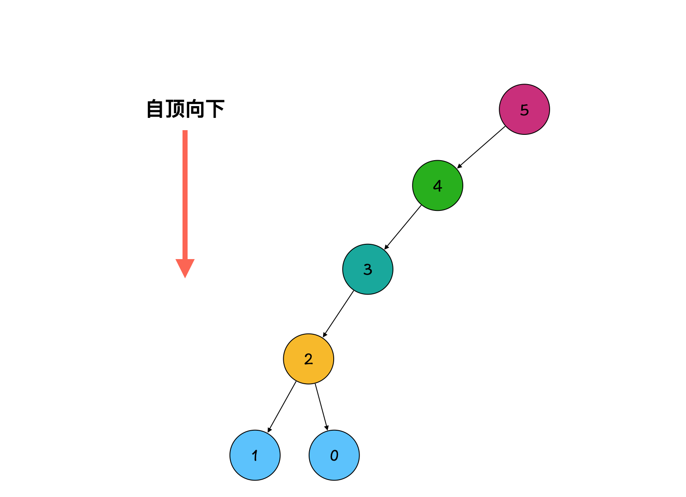
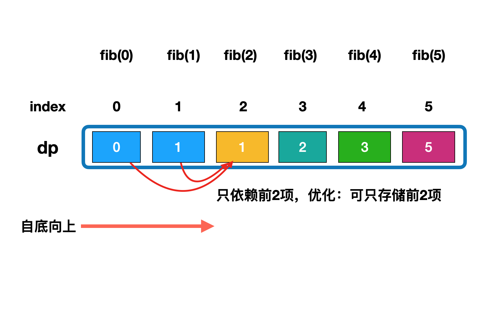

1. [242. 有效的字母异位词](#242-有效的字母异位词)
2. [191. 位1的个数](#191-位1的个数)
3. [415. 字符串相加 扩展](#415-字符串相加-扩展)
4. [补充题9. 36进制加法](#补充题9-36进制加法)
5. [152. 乘积最大子数组](#152-乘积最大子数组)
6. [剑指 Offer 52. 两个链表的第一个公共节点](#剑指-offer-52-两个链表的第一个公共节点)
7. [74. 搜索二维矩阵](#74-搜索二维矩阵)
8. [剑指 Offer 53 - I. 在排序数组中查找数字 I](#剑指-offer-53---i-在排序数组中查找数字-i)
9. [91. 解码方法](#91-解码方法)
10. [1047. 删除字符串中的所有相邻重复项](#1047-删除字符串中的所有相邻重复项)
11. [剑指 Offer 11. 旋转数组的最小数字](#剑指-offer-11-旋转数组的最小数字)
12. [补充题14. 阿拉伯数字转中文数字](#补充题14-阿拉伯数字转中文数字)
13. [47. 全排列 II](#47-全排列-ii)
14. [61. 旋转链表](#61-旋转链表)
15. [213. 打家劫舍 II](#213-打家劫舍-ii)
16. [86. 分隔链表](#86-分隔链表)
17. [208. 实现 Trie (前缀树)](#208-实现-trie-前缀树)
18. [876. 链表的中间结点](#876-链表的中间结点)
19. [114. 二叉树展开为链表](#114-二叉树展开为链表)
20. [509. 斐波那契数](#509-斐波那契数)
	 1. [最优解：滚动数组](#最优解滚动数组)
	 2. [方法一：递归](#方法一递归)
	 3. [方法二：带备忘录递归](#方法二带备忘录递归)
	 4. [方法三：动态规划](#方法三动态规划)
	 5. [方法四：滚动数组](#方法四滚动数组)
21. [556. 下一个更大元素 III](#556-下一个更大元素-iii)


<!-- 
[242. 有效的字母异位词](https://leetcode-cn.com/problems/valid-anagram/)

[191. 位1的个数](https://leetcode-cn.com/problems/number-of-1-bits/)

[补充题9. 36进制加法](https://mp.weixin.qq.com/s/bgD1Q5lc92mX7RNS1L65qA)

[152. 乘积最大子数组](https://leetcode-cn.com/problems/maximum-product-subarray/)

[剑指 Offer 52. 两个链表的第一个公共节点](https://leetcode-cn.com/problems/liang-ge-lian-biao-de-di-yi-ge-gong-gong-jie-dian-lcof/)

[74. 搜索二维矩阵](https://leetcode-cn.com/problems/search-a-2d-matrix/)

[剑指 Offer 53 - I. 在排序数组中查找数字 I](https://leetcode-cn.com/problems/zai-pai-xu-shu-zu-zhong-cha-zhao-shu-zi-lcof/)

[91. 解码方法](https://leetcode-cn.com/problems/decode-ways/)

[1047. 删除字符串中的所有相邻重复项](https://leetcode-cn.com/problems/remove-all-adjacent-duplicates-in-string/)

[剑指 Offer 11. 旋转数组的最小数字](https://leetcode-cn.com/problems/xuan-zhuan-shu-zu-de-zui-xiao-shu-zi-lcof/)

[补充题14. 阿拉伯数字转中文数字]()

[47. 全排列 II](https://leetcode-cn.com/problems/permutations-ii/)

[61. 旋转链表](https://leetcode-cn.com/problems/rotate-list/)

[213. 打家劫舍 II](https://leetcode-cn.com/problems/house-robber-ii/)

[86. 分隔链表](https://leetcode-cn.com/problems/partition-list/)

[208. 实现 Trie (前缀树)](https://leetcode-cn.com/problems/implement-trie-prefix-tree/)

[876. 链表的中间结点](https://leetcode-cn.com/problems/middle-of-the-linked-list/)

[114. 二叉树展开为链表](https://leetcode-cn.com/problems/flatten-binary-tree-to-linked-list/)

[509. 斐波那契数](https://leetcode-cn.com/problems/fibonacci-number/)

[556. 下一个更大元素 III](https://leetcode-cn.com/problems/next-greater-element-iii/)
 -->


------


## [242. 有效的字母异位词](https://leetcode-cn.com/problems/valid-anagram/)

## [191. 位1的个数](https://leetcode-cn.com/problems/number-of-1-bits/)


## [415. 字符串相加](https://leetcode-cn.com/problems/add-strings/) 扩展

``` go
func addStrings(num1 string, num2 string) string {
	carry := 0
	res := ""
	i, j := len(num1)-1, len(num2)-1
	for ; i >= 0 || j >= 0 || carry != 0; i, j = i-1, j-1 {
		var x, y int
		if i >= 0 {
			x = int(num1[i] - '0')
		}
		if j >= 0 {
			y = int(num2[j] - '0')
		}
		sum := x + y + carry
		res = strconv.Itoa(sum%10) + res
		carry = sum / 10
	}
	return res
}
```

## [补充题9. 36进制加法](https://mp.weixin.qq.com/s/bgD1Q5lc92mX7RNS1L65qA)

``` go
func addStrings(num1 string, num2 string) string {
	carry := 0
	res := ""
	i, j := len(num1)-1, len(num2)-1
	for ; i >= 0 || j >= 0 || carry != 0; i, j = i-1, j-1 {
		var x, y int
		if i >= 0 {
			x = int(num1[i] - '0')
		}
		if j >= 0 {
			y = int(num2[j] - '0')
		}
		sum := x + y + carry
		res = strconv.Itoa(sum%10) + res
		carry = sum / 10
	}
	return res
}
```


## [152. 乘积最大子数组](https://leetcode-cn.com/problems/maximum-product-subarray/)

## [剑指 Offer 52. 两个链表的第一个公共节点](https://leetcode-cn.com/problems/liang-ge-lian-biao-de-di-yi-ge-gong-gong-jie-dian-lcof/)

## [74. 搜索二维矩阵](https://leetcode-cn.com/problems/search-a-2d-matrix/)

## [剑指 Offer 53 - I. 在排序数组中查找数字 I](https://leetcode-cn.com/problems/zai-pai-xu-shu-zu-zhong-cha-zhao-shu-zi-lcof/)

## [91. 解码方法](https://leetcode-cn.com/problems/decode-ways/)

## [1047. 删除字符串中的所有相邻重复项](https://leetcode-cn.com/problems/remove-all-adjacent-duplicates-in-string/)

## [剑指 Offer 11. 旋转数组的最小数字](https://leetcode-cn.com/problems/xuan-zhuan-shu-zu-de-zui-xiao-shu-zi-lcof/)

## [补充题14. 阿拉伯数字转中文数字]()

## [47. 全排列 II](https://leetcode-cn.com/problems/permutations-ii/)

## [61. 旋转链表](https://leetcode-cn.com/problems/rotate-list/)

## [213. 打家劫舍 II](https://leetcode-cn.com/problems/house-robber-ii/)

## [86. 分隔链表](https://leetcode-cn.com/problems/partition-list/)

## [208. 实现 Trie (前缀树)](https://leetcode-cn.com/problems/implement-trie-prefix-tree/)

## [876. 链表的中间结点](https://leetcode-cn.com/problems/middle-of-the-linked-list/)

## [114. 二叉树展开为链表](https://leetcode-cn.com/problems/flatten-binary-tree-to-linked-list/)

## [509. 斐波那契数](https://leetcode-cn.com/problems/fibonacci-number/)


### 最优解：滚动数组


```go
func fib(n int) int {
	prev, curr := 0, 1
	for ; n > 0; n-- { 
		sum := prev + curr
		prev = curr
		curr = sum
	}
	return prev
}

func fib1(n int) int {
	prev, curr := 0, 1
	for i := 0; i < n; i++ { // n--
		sum := prev + curr
		prev = curr
		curr = sum
	}
	return prev
}

func fib2(n int) int {
	if n == 0 || n == 1 {
		return n
	}
	prev, curr := 0, 1
	for i := 2; i <= n; i++ {
		sum := prev + curr
		prev = curr
		curr = sum
	}
	return curr
}
```


复杂度分析

- 时间复杂度：O(n)。
- 空间复杂度：O(1)。


---

### 方法一：递归


``` go
func fib(n int) int {
	if n == 0 || n == 1 {
		return n
	}
	return fib(n-1) + fib(n-2)
}
```

复杂度分析

- 时间复杂度：O(2^n)。
- 空间复杂度：O(h)。

### 方法二：带备忘录递归




闭包写法：
``` go
func fib(n int) int {
	memo := make([]int, n+1)//从0开始
	var helper func(int) int

	helper = func(n int) int {
		if n == 0 || n == 1 {
			return n
		}
		if memo[n] != 0 {
			return memo[n]
		}
		memo[n] = helper(n-1) + helper(n-2)
		return memo[n]
	}

	return helper(n)
}
```

``` go
func fib(n int) int {
	memo := make([]int, n+1)
	return helper(memo, n)
}
func helper(memo []int, n int) int {
	if n < 2 {
		return n
	}
	if memo[n] != 0 { //剪枝
		return memo[n]
	}
	memo[n] = helper(memo, n-1) + helper(memo, n-2)
	return memo[n]
}
```

复杂度分析

- 时间复杂度：O(n)。
- 空间复杂度：O(n)。

### 方法三：动态规划


``` go
func fib(n int) int {
	if n == 0 {
		return 0
	}
	dp := make([]int, n+1)
	dp[0], dp[1] = 0, 1       //base case
	for i := 2; i <= n; i++ { //状态转移
		dp[i] = dp[i-1] + dp[i-2]
	}
	return dp[n]
}
```
复杂度分析

- 时间复杂度：O(n)。
- 空间复杂度：O(n)。


### 方法四：滚动数组


动态规划空间优化：只存储前2项

``` go
func fib(n int) int {
	if n == 0 || n == 1 { //base case
		return n
	} //递推关系
	prev, curr := 0, 1
	for i := 2; i <= n; i++ {
		next := prev + curr // sum
		prev = curr
		curr = next
	}
	return curr
}
```


复杂度分析

- 时间复杂度：O(n)。
- 空间复杂度：O(1)。


## [556. 下一个更大元素 III](https://leetcode-cn.com/problems/next-greater-element-iii/)


